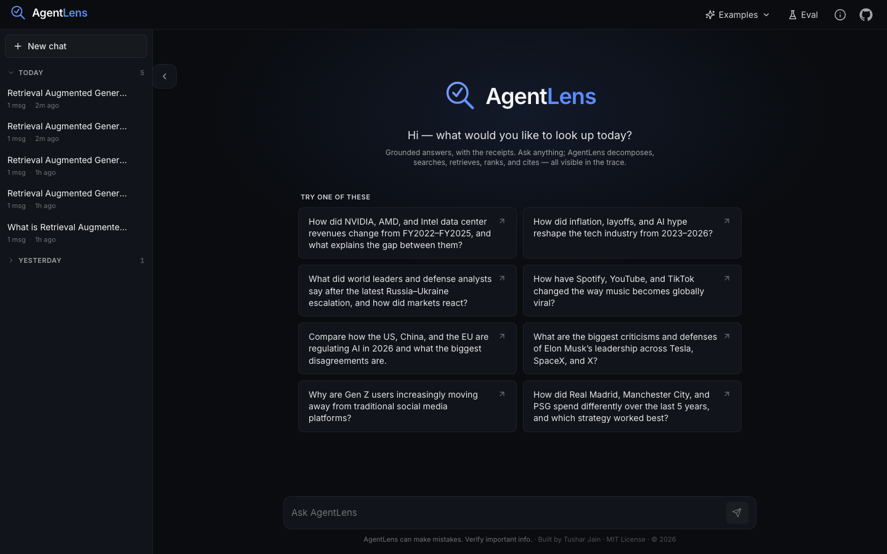
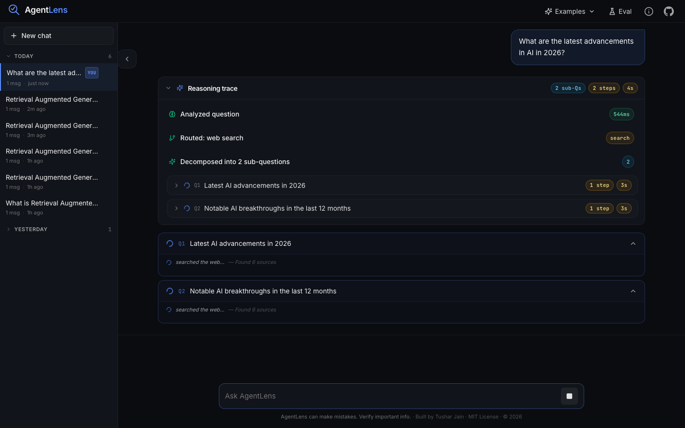
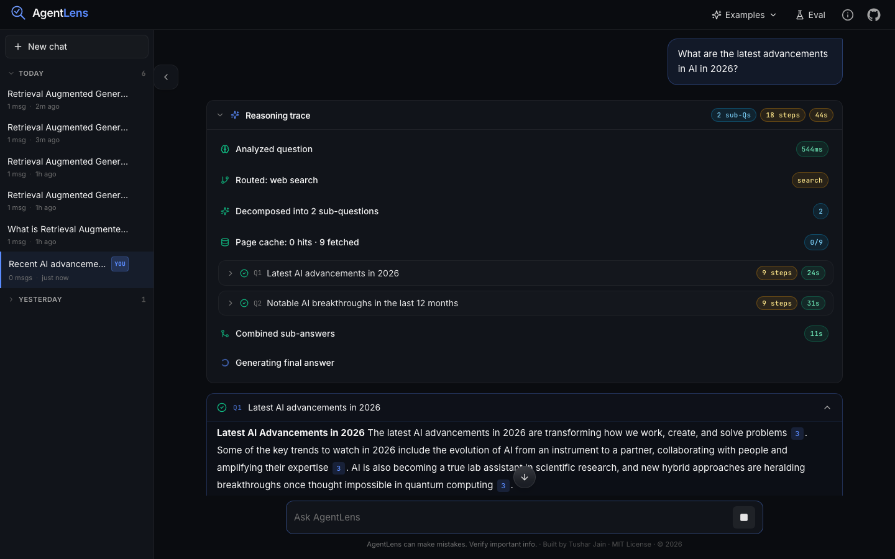
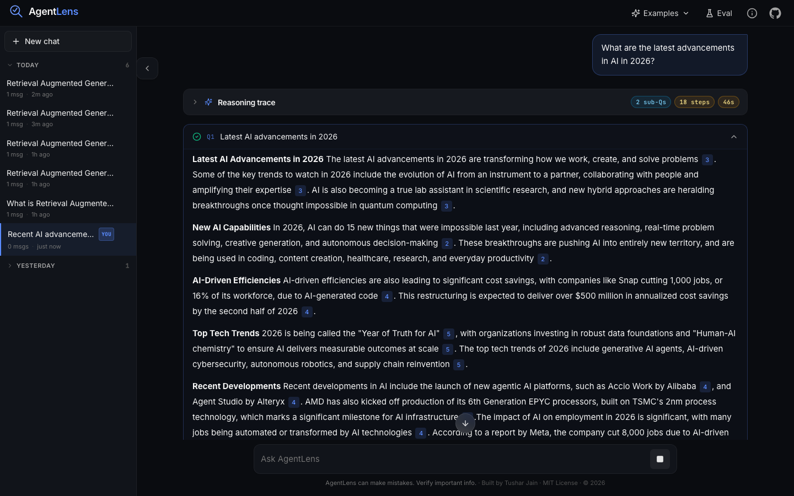
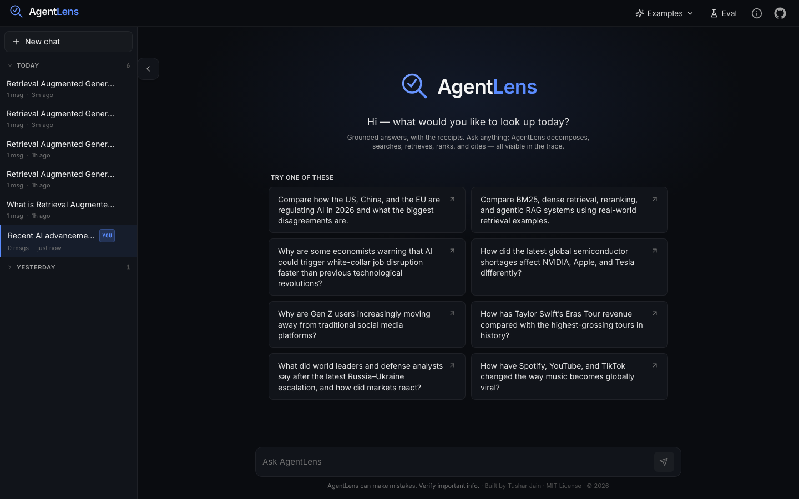
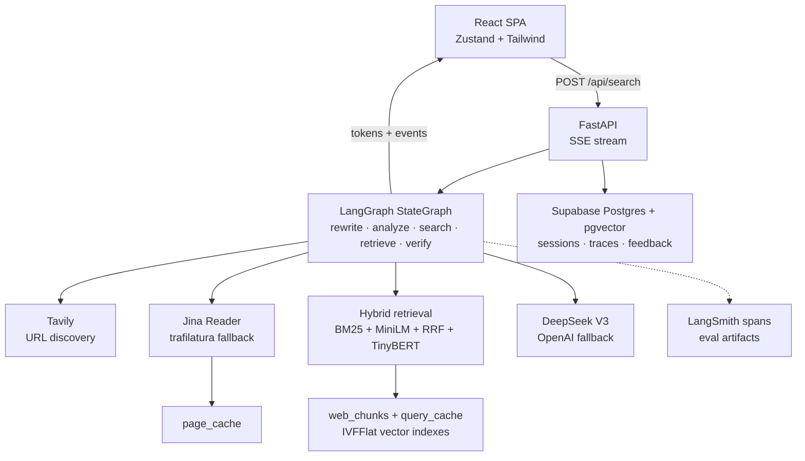
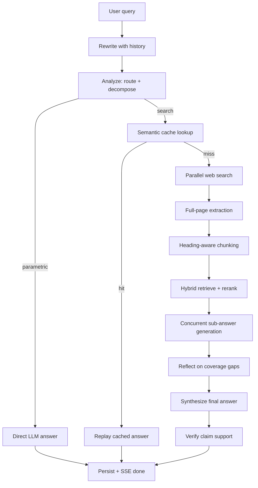

# AgentLens

> A production-grade agentic web research RAG system — retrieves full-page content, runs hybrid semantic search, reflects on coverage gaps, checks claims for source support, and streams grounded answers with citations in real time.

[](https://python.org)
[](https://fastapi.tiangolo.com)
[](https://react.dev)
[](https://langchain-ai.github.io/langgraph/)
[](https://github.com/tusharjain1003/AgentLens/actions/workflows/ci.yml)
[](LICENSE)

---

## Table of Contents

- [Visual Tour](#visual-tour)
- [Architecture Overview](#architecture-overview)
- [Pipeline Walkthrough](#pipeline-walkthrough)
- [Key Features](#key-features)
- [Tech Stack](#tech-stack)
- [Quick Start](#quick-start)
- [API Reference](#api-reference)
- [Evaluation Results](#evaluation-results)
- [Deployment](#deployment)
- [Project Structure](#project-structure)
- [Design Decisions](#design-decisions)
- [Contributing](#contributing)

---

## Visual Tour

Representative screenshots from the app flow. Duplicate states such as the about modal and pre-submit input screen are intentionally omitted here; the full set lives in [`screenshots/`](screenshots/).

| Home | Streaming Search |
|------|------------------|
|  |  |

| Completed Answer | Expanded Reasoning Trace |
|------------------|--------------------------|
|  |  |

| Citations & Follow-ups | Session History |
|------------------------|-----------------|
|  |  |

---

## Architecture Overview

AgentLens answers natural-language questions by orchestrating real-time web retrieval, full-page extraction, hybrid semantic search, cross-encoder reranking, reflection-based gap recovery, claim verification, and LLM synthesis — all streamed to the frontend via Server-Sent Events before the pipeline completes.

**Three non-negotiable design constraints drive the architecture:**

1. **Every query passes through an LLM.** No heuristic routing. The `analyze` node makes a reasoned routing decision — parametric vs. search — using few-shot classification with a strong search bias.
2. **Streaming must start in under 3 seconds.** LangGraph + asyncio concurrency ensures first SSE events fire ~500ms in; first tokens within ~3s regardless of pipeline depth.
3. **Retrieval is global, not per-sub-query.** Extraction runs once on the deduplicated URL union — eliminating redundant fetches and ensuring citation number consistency across sub-answers.

### System Diagram



### Request Lifecycle



---

## Pipeline Walkthrough

The pipeline is a [LangGraph StateGraph](https://langchain-ai.github.io/langgraph/) — 14+ nodes with conditional routing edges, each emitting typed LangSmith spans.

### 1. Rewrite & Route (`analyze.py`)
- **Query rewriting**: history-aware rewriting to resolve anaphora and carry forward active constraints
- **Route classification**: "parametric" (bypass search), "search" (full RAG pipeline), or "unsupported" (polite decline)
- **Decomposition**: splits complex queries into parallel sub-queries
- SSE: `rewrite_done` → `route_done` → `decompose_done`

### 2. Cache Lookup (`query_cache.py`)
- pgvector ANN lookup at cosine ≥ 0.92 replays cached answers in 1–3s
- SSE: `cache_result` (hit) or continues to search

### 3. Search (`search.py`)
- Parallel Tavily URL discovery per sub-query
- SSE: `search_done`

### 4. Extract (`extract.py`)
- Full-page content extraction via Jina Reader (primary) → trafilatura (fallback)
- Page cache: avoids re-fetching URLs within TTL
- Unicode normalization: NFKC + bidi-override removal + homoglyph mapping
- **Prompt-injection defense**: indirect injection detection on extracted links
- SSE: `extract_done`

### 5. Chunk & Embed (`chunk.py`, `embed.py`)
- Heading-aware markdown chunking (200-char overlap, garbage filter)
- MiniLM-L6-v2 batch embedding via asyncio executor
- SSE: `chunk_done` → `embed_done`

### 6. Hybrid Retrieval (`retrieve.py`)
- Three signals fused via Reciprocal Rank Fusion (k=60):
  - **BM25**: exact term matching (entities, tickers, technical terms)
  - **Dense**: MiniLM cosine similarity (semantic paraphrases)
  - **Cross-encoder**: TinyBERT joint attention (precision ranking)
- **Source credibility boost**: academic/gov (+0.008), established outlets (+0.004), forum/UGC (-0.003)
- **Recency bonus**: temporal queries get +0.002/yr for content ≥ 2022
- SSE: `retrieve_done` → `rerank_done`

### 7. Reflection (`graph.py`, `node_reflect`)
- Post-retrieval coverage check: LLM evaluates sub-answers for gaps
- On gap detection: re-decomposes into gap queries, retrieves from existing cache, generates and merges augmented sub-answers
- Tracks iteration count; capped at 1 iteration (max 2 passes through the reflection node) to bound latency
- SSE: `reflection_done` with gap metadata

### 8. Generate (`generate.py`)
- Streaming LLM generation per sub-query (concurrent via `asyncio.Queue`)
- Structured prompt delimiters: `<INSTRUCTION>`, `<SOURCE id="N">`, `<SUBANSWER>`, `<HISTORY>`
- **Output validation**: citation range checks, instruction-hijack detection, answer repair
- SSE: `sub_answer_start` → `sub_answer_token*` → `sub_answer_done`

### 9. Synthesize (`graph.py`, `node_synthesize`)
- Multi-sub-query only: merges parallel sub-answers into a coherent final answer
- Citation number reconciliation across sub-queries
- SSE: `synthesis_start` → `token*` → `synthesis_done`

### 10. Verify (`graph.py`, `node_verify`)
- Lightweight claim support check against source chunks
- Two modes:
  - **Flag mode**: flags unsupported claims inline (fast, non-blocking)
  - **Quality mode**: re-generates the answer with unsupported claims removed or corrected
- SSE: `verify_done`

### 11. Emit Done (`graph.py`, `node_emit_done`)
- Follow-up question generation
- Session persistence (DB write with `RETURNING id` for feedback loop)
- SSE: `done`

---

## Key Features

### Agentic Capabilities

| Feature | Description |
|---------|-------------|
| **Adaptive Tool Routing** | LLM selects tools (web search, calculator, academic search) with logged rationale and confidence score |
| **Reflection Loop** | Post-retrieval coverage check identifies answer gaps, re-decomposes into gap queries, retrieves from cached content, and merges augmented sub-answers |
| **Claim Support Check** | Post-hoc hallucination guard: extracts claims from answer, checks each against source chunks via word-overlap heuristic (flag or regenerate mode) |
| **Parametric Routing** | Arithmetic, geography, and textbook-stable facts bypass search entirely (~2-5s vs 25-60s) |
| **Unsupported Handling** | PDFs, diagrams, images, code execution → polite decline that redirects to what AgentLens *can* do |

### Search & Retrieval

| Feature | Description |
|---------|-------------|
| **Full-Page Extraction** | No reliance on search snippets; Jina Reader → trafilatura fallback with page cache |
| **Heading-Aware Chunking** | Markdown heading boundaries as semantic split points, 200-char overlap |
| **Hybrid Retrieval** | BM25 + dense cosine → RRF fusion → TinyBERT cross-encoder (top-8) |
| **Source Credibility Ranking** | Four-tier domain classification with configurable RRF boost |
| **Semantic Query Cache** | pgvector ANN at cosine ≥ 0.92 replays cached answers in 1–3s |
| **Recency Bonus** | Temporal queries boost recent content automatically |

### Production Hardening

| Feature | Description |
|---------|-------------|
| **Prompt-Injection Protection** | Unicode normalization, structured prompt delimiters, indirect injection detection in extracted pages, post-generation output validation with automatic answer repair |
| **API Authentication** | Optional `X-API-Key` verification (env-driven, enforced when `api_key` is set) |
| **Rate Limiting** | Configurable per-minute limit on `/api/search` via `slowapi` |
| **Human Feedback Loop** | Thumbs up/down with free-text correction, citation-level reports, persisted to `rag_feedback` table |

### Streaming & Observability

| Feature | Description |
|---------|-------------|
| **Concurrent SSE Streams** | All sub-query LLM calls stream simultaneously; final synthesis streamed on completion |
| **LangSmith Spans** | Every node emits typed spans (`llm`, `retriever`, `tool`, `chain`) with key attributes |
| **Per-Request Timing** | Stage-level latency breakdown in every SSE event |
| **Token Cost Tracking** | Per-request token usage and estimated cost |
| **Session Persistence** | JSONB traces enable byte-identical reasoning trace replay on reload |

### Frontend

| Feature | Description |
|---------|-------------|
| **Live Reasoning Trace** | Expandable per-subquery steps, retrieval results, citation chips |
| **Follow-up Suggestions** | AI-generated follow-up questions after each answer |
| **Session Management** | Session history with full trace replay |
| **Evaluation Dashboard** | Dev-only eval results inspector |
| **Dark Mode** | Tailwind CSS with dark theme |

---

## Observability

LangSmith tracing is built into every LangGraph node — each emits a typed span:

| Node | `run_type` | Key span attributes |
|------|------------|-------------------|
| `analyze` | `chain` | `mode`, `sub_queries`, `tools_selected`, `confidence`, `route_reason` |
| `search_urls` | `retriever` | `query`, `results_count`, `source` |
| `extract_pages` | `chain` | `pages`, `failures`, `injection_flags` |
| `retrieve` | `retriever` | `bm25_hits`, `dense_hits`, `rerank_scores`, `tier_distribution` |
| `generate` | `llm` | `chunks_available`, `citations_used`, `utilization_ratio` |
| `reflect` | `chain` | `gaps_found`, `gap_queries`, `iteration`, `action` |
| `verify` | `chain` | `total_claims`, `supported`, `unsupported`, `mode` (lightweight word-overlap check) |

Tracing is off by default to keep costs predictable. Enable per-request:

```bash
curl -H "X-Langsmith-Trace: true" ...
# or for full eval runs:
python evals/run_eval.py --full --trace on
```

---

## Tech Stack

| Layer | Technology |
|-------|-----------|
| **Backend** | FastAPI, Uvicorn, asyncio |
| **Orchestration** | LangGraph StateGraph (14+ nodes, conditional routing) |
| **Database** | Supabase — PostgreSQL + pgvector (IVFFlat, cosine ops) |
| **Search** | Tavily API (URL discovery, parallel per sub-query) |
| **Extraction** | Jina Reader (primary), trafilatura (fallback) |
| **Embeddings** | sentence-transformers — all-MiniLM-L6-v2 (384-dim) |
| **Sparse Retrieval** | BM25Okapi (rank-bm25, in-process) |
| **Fusion** | Reciprocal Rank Fusion (RRF, k=60) |
| **Reranking** | Cross-Encoder — ms-marco-TinyBERT-L-2-v2 |
| **LLM** | DeepSeek V3 (primary) · OpenAI GPT (fallback) |
| **Observability** | LangSmith (per-node typed spans) |
| **Frontend** | React 18, Vite, TypeScript, Zustand, Tailwind CSS |
| **Streaming** | Server-Sent Events (SSE) |

---

## Quick Start

### Prerequisites

- Python 3.11+
- Node.js 18+
- Supabase account (PostgreSQL + pgvector) — or Docker for local Postgres
- API keys: [DeepSeek](https://platform.deepseek.com), [Tavily](https://tavily.com)

### One-Command Dev (Docker Compose)

```bash
git clone https://github.com/tusharjain1003/AgentLens.git
cd AgentLens
docker compose up --build
```

Set your API keys in the environment (or a `.env` file), then initialize the database once:

```bash
docker compose exec backend python db/setup.py
```

| Service | URL |
|---------|-----|
| Backend API | `http://localhost:8765` |
| Frontend SPA | `http://localhost:5174` |
| Postgres/pgvector | `localhost:5432` |

### Manual Setup

```bash
python3 -m venv .venv && source .venv/bin/activate
pip install -r requirements.txt

cp .env.example .env
# Fill in DATABASE_URL, DEEPSEEK_API_KEY, TAVILY_API_KEY
```

Initialize DB and start:

```bash
python db/setup.py
uvicorn app:app --reload --port 8000
```

Frontend:

```bash
cd frontend
npm install
npm run dev
```

---

## API Reference

### Search — `POST /api/search`

Streaming RAG pipeline via SSE.

```json
{
  "query": "What is RAG and how does it work?",
  "session_id": "optional-session-uuid",
  "max_results": 6,
  "top_k": 8
}
```

**SSE event sequence:**

| Event | Carries | Timing |
|-------|---------|--------|
| `rewrite_done` | original + rewritten query, rewrite decision | ~300ms |
| `route_done` | mode, route_reason, confidence | ~300ms |
| `decompose_done` | sub_queries, rewritten_query | ~500ms |
| `page_cache_info` | hits, misses, urls_from_cache | — |
| `search_done` | urls, per_subquery[] | ~1-2s |
| `injection_warning` | indirect URL injection flags (if any) | ~2-3s |
| `extract_done` | pages, failures, per_subquery[] | ~2-4s |
| `chunk_done` | count, stats, per_subquery[] | ~3s |
| `embed_done` | candidate_count, device | ~3-4s |
| `retrieve_done` | total_chunks, sub_queries | ~3-4s |
| `rerank_done` | per_subquery with top_k, max_score, explain | ~3-4s |
| `sub_answer_start` | query, ranked chunks, citations | ~3-4s |
| `sub_answer_token*` | index, text token | streaming |
| `sub_answer_done` | latency, utilization_ratio, validation | — |
| `reflection_start/done` | gap analysis, iteration count | — |
| `synthesis_start/token/done` | final merged answer (multi-SQ only) | — |
| `verify_done` | claim support check results | — |
| `done` | session_id, message_id, citations, latency_breakdown, followups | final |
| `error` | message, reason, failures[] | on failure |

### Sessions

```
GET    /api/sessions?limit=50         List sessions (title, created_at, message_count)
GET    /api/sessions/{session_id}     Full session with message traces
DELETE /api/sessions/{session_id}     Delete session and messages
```

### Feedback

```
POST   /api/feedback                  Submit rating (-1/0/1), correction, citation report
```

### Health

```
GET    /api/health                    Environment info, version, LLM provider
```

---

## Evaluation Results

AgentLens ships with a production-grade automated evaluation harness: 52 questions across 11 adversarial categories, 5 core metrics judged by LLM-as-judge, with auto-classified failure analysis.

### Latest Results (v12 — 52-question benchmark)

| Metric | Score | Verdict |
|--------|-------|---------|
| **Aggregate (5-core mean)** | **0.789** | Strong |
| Answer Correctness | 0.950 | Excellent |
| Context Recall | 0.867 | Strong |
| Routing & Decomposition | 0.825 | Strong |
| Context Precision | 0.654 | Improving |
| Faithfulness | 0.649 | Action item |

**15 pass · 15 partial · 0 fail** of 30 questions (52-question benchmark, 30 in primary eval metric set)

### Version-over-Version Progress

| Version | Questions | Aggregate | Pass | Key Change |
|---------|-----------|-----------|------|------------|
| v1 | 10 | 0.735 | 3 | RAG-trivia only |
| v6 | 15 | 0.393 | 1 | SEC/earnings domain introduced |
| v7 | 30 | 0.718 | 9 | 5-metric harness, 10-domain mix |
| v8 | 30 | 0.732 | 12 | LangSmith spans, cache fixes |
| v9 | 30 | 0.789 | 15 | Node restructure, chunking quality |
| v12 | 52 | 0.789 | 15 | Reflection, claim check, routing improvements |

### Per-Category Breakdown

| Category | Avg Score | Key Insight |
|----------|-----------|-------------|
| `routing_parametric` | 1.000 | Perfect; arithmetic/geography bypasses search |
| `niche_long_tail` | 1.000 | Strong on obscure factual queries |
| `ambiguity` | 0.858 | Handles ambiguous questions well |
| `contradiction` | 0.771 | Conflicting evidence handled |
| `multi_hop_comparison` | 0.770 | Weakest category; under-decomposition on multi-entity queries |
| `numerical_reasoning` | 0.755 | Good recall; precision gaps on financial data |
| `temporal_freshness` | 0.721 | Struggles with phased regulatory events |
| `refusal_unknown` | 0.550 | Correctly refuses; lacks explicit signaling |

### Failure-Mode Distribution

| Mode | Count | Root Cause |
|------|-------|------------|
| `wrong_route` | 2 | Router misclassifies ambiguous queries |
| `retrieval_miss` | 1 | Cross-encoder threshold tuning needed |
| `hallucination` | 1 | Synthesis LLM adds uncited claims |

### Run Eval Yourself

```bash
# Quick smoke test (2 questions)
python evals/run_eval.py --smoke

# Full benchmark (52 questions)
python evals/run_eval.py --full

# Multi-turn scenarios
python evals/run_eval.py --multiturn

# Full with LangSmith tracing
python evals/run_eval.py --full --trace on
```

Results saved to `evals/results/{timestamp}/` with:
- `summary.json` — aggregate + category breakdown
- `report.md` — human-readable score table
- `failures.md` — worst-N questions with auto-classified cause
- `eval.log` — pipeline + judge output

---

## Deployment

### Railway (Recommended)

```bash
npm install -g @railway/cli
railway link
railway up
railway run python db/setup.py   # one-time
```

### Required Environment Variables

| Variable | Purpose |
|----------|---------|
| `DATABASE_URL` | Supabase pooled connection (port 6543) |
| `DEEPSEEK_API_KEY` | Primary LLM |
| `TAVILY_API_KEY` | URL discovery |

### Optional Variables

| Variable | Default | Notes |
|----------|---------|-------|
| `OPENAI_API_KEY` | — | LLM fallback |
| `ENVIRONMENT` | `development` | `production` disables debug |
| `PUBLIC_MODE` | `false` | `true` hides session list from users |
| `SEMANTIC_CACHE_ENABLED` | `false` | Enable pgvector semantic cache |
| `LOG_LEVEL` | `INFO` | `DEBUG` for detailed traces |
| `API_KEY` | — | Enables `X-API-Key` auth |
| `RATE_LIMIT_PER_MINUTE` | 10 | Requests per minute on `/api/search` |
| `PORT` | `8000` | Set automatically by Railway |

### Cost Estimate

| Service | Monthly Cost |
|---------|-------------|
| Railway (Python app) | $5–20 |
| Supabase (pgvector) | $10–50 |
| DeepSeek API | $0.01–1 (~0.01¢/query) |
| Tavily API | $0.20–5 |
| **Total** | **~$15–75** |

See [DEPLOYMENT.md](docs/DEPLOYMENT.md) for detailed Railway, Heroku, and AWS instructions.

---

## Project Structure

```
├── app.py                 FastAPI entrypoint + SSE orchestrator
├── config.py              Env-driven configuration
├── pipeline/              RAG pipeline — one file per stage
│   ├── graph.py           LangGraph StateGraph: nodes, edges, orchestration
│   ├── runtime.py         SSE queue, timing, token tracker via contextvars
│   ├── analyze.py         Rewrite + route + decompose (LLM)
│   ├── query_cache.py     pgvector ANN semantic cache
│   ├── search.py          Tavily URL discovery (parallel per sub-query)
│   ├── extract.py         Jina Reader + trafilatura + normalization + injection detection
│   ├── chunk.py           Heading-aware markdown chunker
│   ├── embed.py           MiniLM batch encode (asyncio executor)
│   ├── retrieve.py        BM25 + dense → RRF → cross-encoder + credibility boost
│   ├── generate.py        Streaming LLM + synthesis + citation alignment
│   ├── followups.py       Post-answer follow-up suggestions
│   └── title.py           Background session title upgrade
├── llm/                   Vendor-agnostic LLM protocol
│   ├── base.py            LLM protocol: acomplete() + astream()
│   ├── deepseek.py        DeepSeek V3 client (default)
│   └── openai_client.py   OpenAI client (fallback)
├── db/                    PostgreSQL access layer
│   ├── client.py          Async asyncpg connection pool
│   ├── schema.sql         Authoritative DDL
│   ├── setup.py           One-shot schema apply
│   ├── sessions.py        CRUD for sessions + messages
│   └── feedback.py        Human feedback persistence
├── frontend/              React 18 + Vite + TypeScript SPA
│   └── src/
│       ├── components/    All UI components
│       ├── state/
│       │   └── chatStore.ts  Zustand store: SSE handlers + rehydrateSteps
│       └── lib/
│           ├── sse.ts     SSE consumer (streamSearch)
│           └── types.ts   Shared TypeScript types
├── evals/                 Evaluation harness
│   ├── run_eval.py        CLI runner: 5 metrics, async concurrent
│   ├── question_dataset/  Benchmark questions (single-turn + multiturn)
│   └── results/           Timestamped run artifacts with failure analysis
├── dev/                   Local dev convenience scripts
│   ├── run_backend.bat    Start FastAPI on localhost:8765 (Windows)
│   └── run_frontend.bat   Start Vite dev server on localhost:5174 (Windows)

├── .github/workflows/     CI, eval-smoke, and deploy workflows
└── docs/                  Full documentation
    ├── ARCHITECTURE.md    System architecture
    ├── RAG-MODEL-PIPELINE.md  Deep-dive retrieval pipeline
    ├── DEPLOYMENT.md      Railway, env vars, public mode
    └── DIRECTORY-STRUCTURE.md  File-by-file responsibility map
```

---

## Design Decisions

### Non-Obvious Tradeoffs

**Why retrieval is global, not per-sub-query.** Extraction runs once over the deduplicated URL union across all sub-queries. This eliminates redundant fetches for overlapping URLs (common in comparison queries), ensures citation number consistency across sub-answers, and halves extraction latency at the cost of a slightly larger chunk pool per retrieval call.

**Why the reflection loop is capped at 1 iteration.** Each reflection pass calls the LLM to detect gaps, re-decomposes if needed, retrieves from the *already-cached* chunk pool (never re-fetches from the web), and merges augmented sub-answers. A second pass would retrieve from the same cache — diminishing returns for 2-3s of additional latency. The cap bounds worst-case latency to ~65s instead of unbounded growth.

**Why the claim support check runs post-streaming.** The checker reads the complete answer text and compares each claim against source chunks via word-overlap. Running it before streaming would block the user from seeing any answer for an additional 3-5s. Running it after `done` means the user sees the answer immediately; if it finds unsupported claims, it flags them inline or regenerates (quality mode) before the next turn.

### Technology Choices

| Decision | Chosen | Alternative | Tradeoff |
|----------|--------|-------------|----------|
| Orchestration | LangGraph | Custom coroutine | LangSmith observability; conditional routing as graph edges |
| Search API | Tavily | Bing, SerpAPI | Structured results; generous free tier |
| Page extraction | Jina Reader → trafilatura | Playwright headless | No browser dependency; ~800ms cold vs ~3s headless |
| Embedding | MiniLM 384-dim | MPNet, OpenAI ada-002 | 2-3× faster; ~5% quality gap; no per-embedding cost |
| Vector DB | pgvector (Postgres) | Pinecone, Qdrant | Co-located with session/cache; no extra service |
| Fusion | RRF k=60 | Score normalization | Robust to distribution differences; no calibration |
| Reranker | TinyBERT cross-encoder | MonoT5, full BERT | 4× faster; ~2% quality gap; runs on CPU |
| LLM primary | DeepSeek V3 | GPT-4o, Claude Sonnet | ~10× cheaper per token; equivalent synthesis quality |
| Frontend state | Zustand | Redux, React Context | No boilerplate; natural fit for SSE handler patterns |

---

## Contributing

See [CONTRIBUTING.md](CONTRIBUTING.md) for setup instructions, development workflow, coding standards, and how to add new pipeline nodes.

---

## Known Limitations

| Area | Issue | Status |
|------|-------|--------|
| Context precision | 0.654 — off-topic chunks pass the reranker | Cross-encoder threshold tuning |
| Faithfulness | 0.649 — synthesis LLM adds uncited claims | Stricter "cite or omit" prompt |
| Multi-hop comparison | Weakest category; under-decomposition | Reflection + re-decomposition |
| LLM cost tracking | `TokenTracker` wired with real DeepSeek usage data via `stream_options` | Active |

---

## License

MIT — see [LICENSE](LICENSE).

Built with [FastAPI](https://fastapi.tiangolo.com), [LangGraph](https://langchain-ai.github.io/langgraph/), [sentence-transformers](https://www.sbert.net/), [DeepSeek](https://www.deepseek.com/), [Tavily](https://tavily.com/), and [Supabase](https://supabase.com/).
