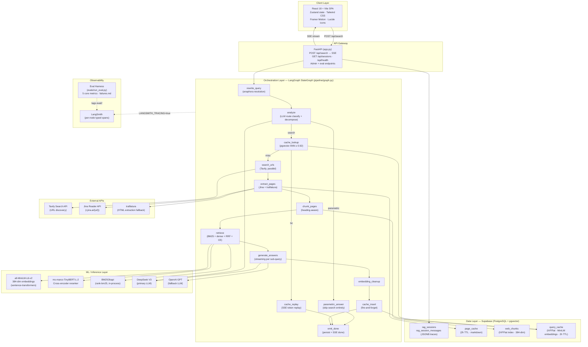
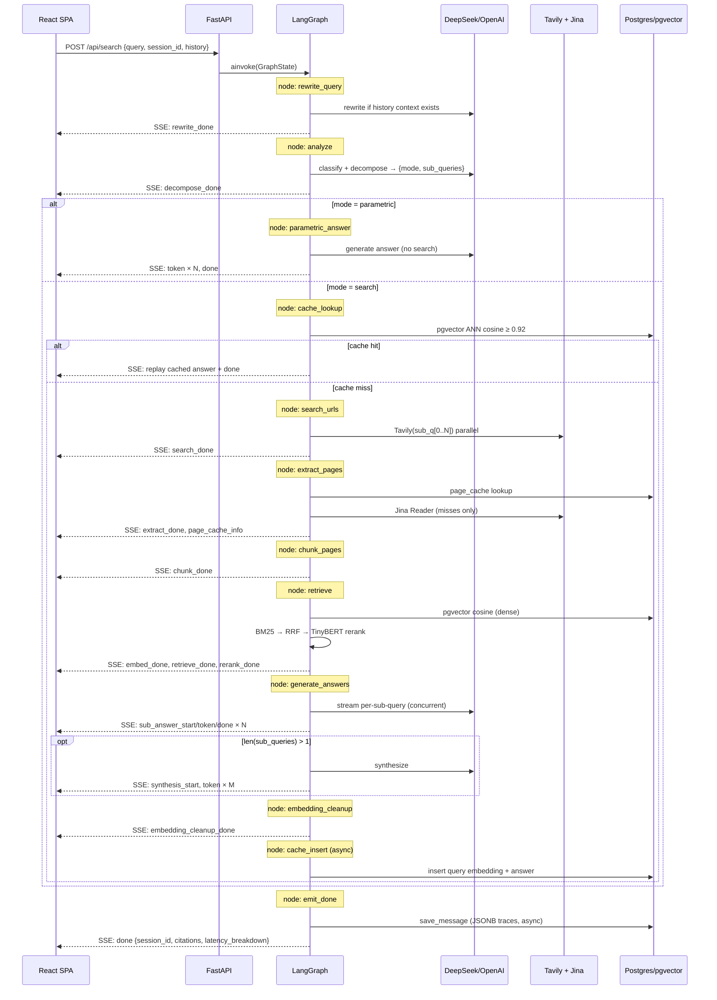
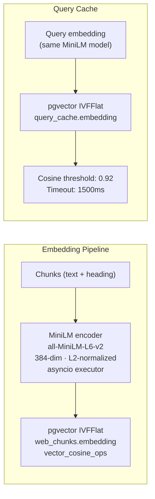
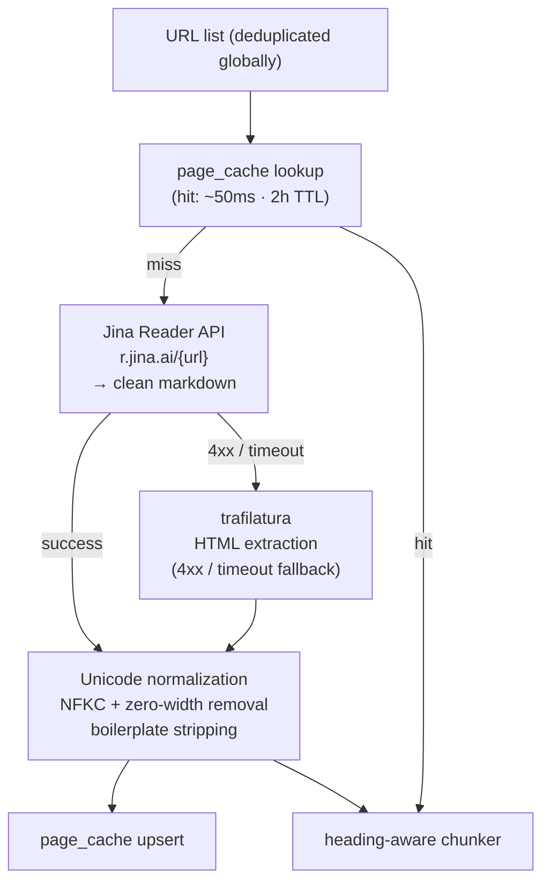
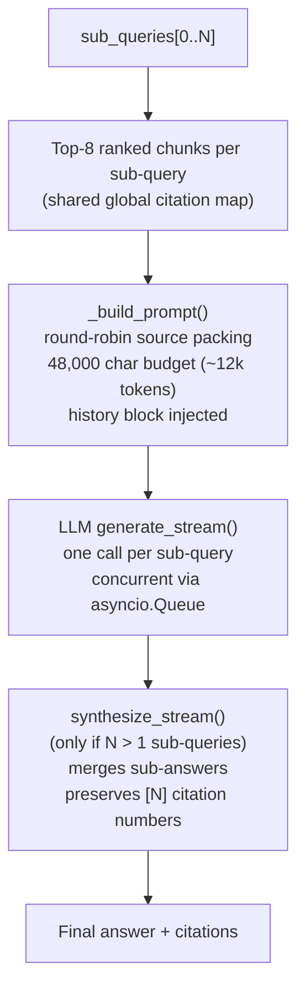
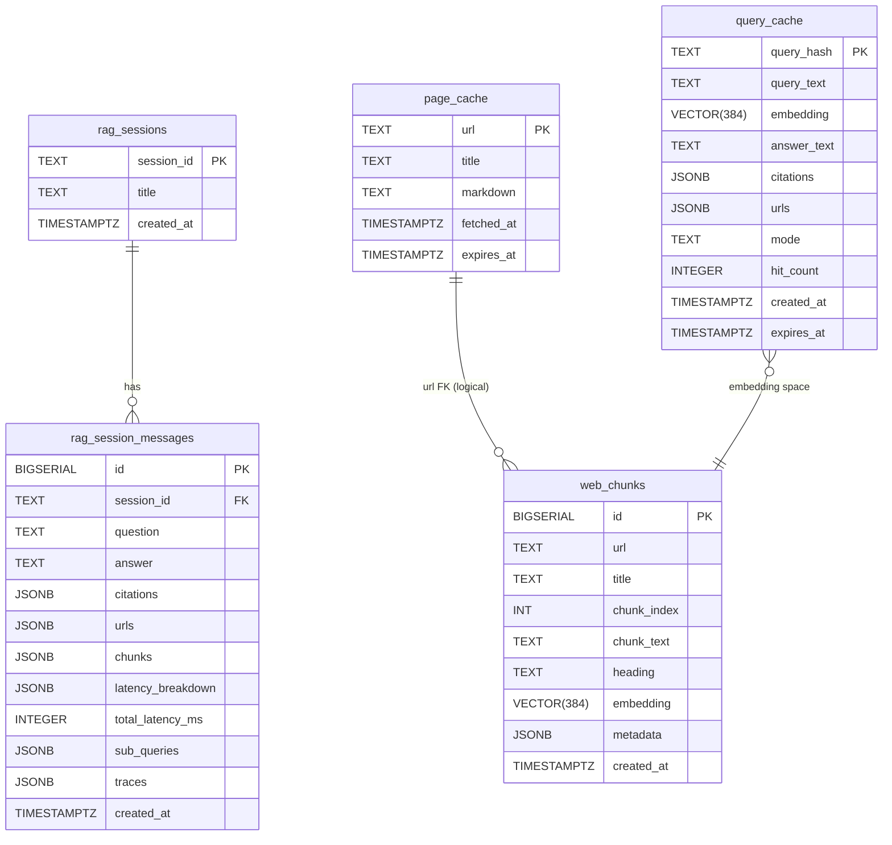

# WebLens — System Architecture

> Current as of v9 (2026-05-11). This document describes the full production architecture. For the version-by-version change history see the `docs/implementation-summary-v*.md` series. For evaluation methodology see [EVALUATION.md](./EVALUATION.md). For the on-disk layout see [DIRECTORY-STRUCTURE.md](./DIRECTORY-STRUCTURE.md).

---

## 1. System Overview

WebLens is a production-grade Web Search RAG system: it answers natural-language questions by orchestrating real-time web retrieval, full-page extraction, hybrid semantic search, cross-encoder reranking, and LLM synthesis — streamed to the user via SSE before the pipeline completes.

The architecture is designed around three non-negotiable constraints:

1. **Every query passes through an LLM.** No heuristic routing (length, shape, keyword). The `analyze` node makes a reasoned routing decision — parametric vs. search — using few-shot-guided classification with a strong search bias.
2. **Streaming must start in under 3 seconds.** LangGraph + asyncio concurrency ensures `decompose_done` fires ~500ms in; sub-answer tokens begin within ~3s regardless of pipeline depth.
3. **Retrieval is global, not per-sub-query.** Extraction runs once on the deduplicated URL union. Per-sub-query statistics are post-hoc partitions of that global result — eliminating redundant extraction and ensuring citation number consistency.

---

## 2. High-Level Architecture



---

## 3. Request Lifecycle

A single search request passes through up to 13 LangGraph nodes. The critical path and branching:



---

## 4. LangGraph Orchestration — `pipeline/graph.py`

### Why LangGraph

Before v7, orchestration was a 500-line `_pipeline_stream` coroutine in `app.py` — a monolithic async function with no branching, no retry hooks, and no observability surface. Three routing decisions (parametric/search, cache-hit/miss, single/multi-SQ synthesis) lived in nested conditionals that were difficult to instrument or extend.

LangGraph provides:
- **Conditional edges** for route branching without nested conditionals
- **Named nodes** that become LangSmith spans automatically
- **`GraphState`** as a typed, serializable data contract between nodes
- **Error short-circuit edges** on each search-pipeline node — a single node failure gracefully emits an error SSE event rather than crashing the full coroutine

### Node Architecture (v9 — 13 nodes)

```
START
  └── rewrite_query
        └── analyze ──────────────────────────────────┐
              ├─[parametric]→ parametric_answer         │
              └─[search]→ cache_lookup                  │
                            ├─[hit]→ cache_replay        │
                            └─[miss]→ search_urls        │
                                       └── extract_pages │
                                             └── chunk_pages
                                                   └── retrieve
                                                         └── generate_answers
                                                               └── embedding_cleanup
                                                                     └── cache_insert
                                                                           └── emit_done ──┘
                                                                                   │
                                                                                  END
```

**Design decision — node granularity.** The linear stages (`search_urls → extract_pages → chunk_pages → retrieve → generate_answers`) are split into separate nodes in v9. Each node has an error short-circuit edge to `emit_done`, and the `RuntimeContext.workspace` dict carries intermediate state (URL lists, extracted pages, chunks, ranked results) between nodes without bloating `GraphState` with non-serializable blobs.

### State Model

`GraphState` (~15 fields) carries only serializable pipeline outputs: query, sub_queries, mode, citations, final_answer, history, cache_enabled. `RuntimeContext` (accessed via `contextvars.ContextVar`) carries runtime concerns: SSE event queue, token tracker, timing. This separation prevents the anti-pattern of putting async queues or callbacks into graph state.

---

## 5. Retrieval Architecture

The retrieval pipeline is the core engineering surface of the system. It combines three complementary signals:

```
                    ALL chunks in working set
                           │
               ┌───────────┴───────────┐
               ▼                       ▼
          BM25Okapi                MiniLM embed
          keyword                  + cosine ANN
          ranking                   (pgvector)
               │                       │
               └───────────┬───────────┘
                           ▼
                    RRF (k=60) fusion
                    → CE_POOL = top 16
                           │
                           ▼
                 TinyBERT cross-encoder
                 (query, chunk) → relevance score
                           │
                           ▼
              Top 8 + dedup + per-URL cap
```

**BM25 (sparse)** — captures exact keyword matches, entity names, technical terminology. Implemented in-process via `rank-bm25`; fast because the working set is at most a few hundred chunks per query.

**Dense retrieval (MiniLM, 384-dim)** — captures semantic similarity. Embeddings are L2-normalized; cosine similarity is computed over the session's chunk set using pgvector. The IVFFlat index on `web_chunks` enables ANN search over the full persisted corpus for cross-query reuse.

**RRF (Reciprocal Rank Fusion, k=60)** — combines BM25 and dense ranks without requiring score calibration. Score formula: `Σ 1/(k + rank_i)`. RRF is robust to score distribution differences between the two retrieval modes — no thresholding or normalization required.

**Cross-encoder reranking (TinyBERT)** — the final precision layer. Unlike bi-encoders (MiniLM), a cross-encoder evaluates (query, chunk) jointly, attending to token interactions. This surfaces chunks with the correct answer even when lexical or semantic similarity alone would rank them low. Cost: O(N × chunk_len) forward passes — justified by operating over only 16 candidates.

**Why this stack over alternatives:**
- Dense-only: misses entity/keyword matches for named entities and technical terms
- BM25-only: fails on paraphrases and semantic similarity
- Cross-encoder as primary retriever: O(corpus) forward passes — infeasible at query time
- The RRF + cross-encoder combination represents the standard production architecture for precision-critical RAG

---

## 6. Embedding and Vector Storage



**Model choice — all-MiniLM-L6-v2:** 384 dimensions strikes the right balance for this use case. At 384-dim, IVFFlat recall is high with fast ANN search; 768-dim models (e.g., `all-mpnet-base-v2`) provide marginal quality gains at roughly 2× storage and compute cost. The sentence-transformers library runs encoding in a thread-pool executor to avoid blocking the asyncio event loop.

**Semantic cache threshold (0.92 cosine):** This is deliberately tight. At 0.85–0.90, paraphrases of different questions may collide (e.g., "What is RRF?" and "What is BM25?"). At 0.92, only near-identical phrasings of the same intent hit the cache. Cache TTL is 2h — short enough to avoid serving stale current-events answers.

**IVFFlat vs HNSW:** IVFFlat was chosen for `web_chunks` and `query_cache` because the corpus size is bounded (the working set for a single query is 50–500 chunks). HNSW would provide better recall-at-speed for a corpus of millions of vectors but has higher memory overhead and longer build time — not worthwhile at this scale.

---

## 7. Page Extraction and Caching



Extraction runs **once globally** on the deduplicated URL union — not per sub-query. This is the key efficiency decision: a URL surfaced by 3 sub-queries is extracted once, and the `url_to_subqueries` mapping preserves which sub-queries each URL serves for post-hoc per-sub-query stat partitioning.

**Jina Reader** is the primary extractor because it returns clean markdown with heading structure preserved — critical for the heading-aware chunker. **trafilatura** is a local Python fallback for sites that block Jina Reader's IP range.

**Boilerplate stripping (v9):** Before storing in the cache, each page passes through NFKC normalization and pattern-based boilerplate removal (nav fragments, subscribe prompts, read-more links, short promo lines). This reduces chunk garbage rate and improves context precision.

---

## 8. Chunking Strategy

**Heading-aware markdown chunker** (`pipeline/chunk.py`):

```
Input: markdown page with heading hierarchy (#, ##, ###)
Output: (chunks[], global_stats, per_url_stats)

Split rule:
  - Segment by heading boundaries
  - Hard max: 1500 chars
  - Overlap: 200 chars between adjacent chunks
  - Min body: 150 chars (short chunks dropped)
  - Min words: 8 (v9)

Garbage filter (v9 enhanced):
  - Word count < 8
  - Markdown link density > 40% AND ≥ 3 links (nav-link lists)
  - > 50% of lines match nav keywords AND ≥ 3 lines (nav fragments)

Drop categories tracked: garbage_dropped · min_body_dropped · dedup_dropped
```

**Why heading-aware over fixed-size:** heading boundaries are semantic boundaries. A 1500-char chunk that crosses a heading boundary mixes topics, hurting both retrieval precision and faithfulness. Preserving heading context in `chunk.heading` also improves cross-encoder scoring — the reranker sees the structural position of the passage.

---

## 9. Generation and Synthesis



**Round-robin source packing** replaces the v5 per-URL 6,000-char hard cap. The previous approach silently dropped chunks when any single URL was verbose. Round-robin distributes the 48k-char budget across all URLs proportionally — no source is disproportionately truncated.

**Concurrent sub-query generation:** all sub-query LLM calls stream concurrently into a single `asyncio.Queue`, multiplexed onto the SSE response. The user sees sub-answer tokens from all sub-queries interleaved rather than waiting for serial completion.

**Global citation map:** `[N]` numbers are assigned once globally across all sub-queries and preserved through synthesis. This means `[3]` in a sub-answer and `[3]` in the synthesis refer to the same source — critical for UI citation button rendering.

**History injection:** the generate and synthesize nodes receive the last 4 turns (capped at 2000 chars) as a bracketed "Recent conversation context (do NOT cite)" block. This resolves mid-answer anaphoric references that the query rewriter couldn't fully bake in.

---

## 10. Parametric Routing

The `analyze` node (v7) runs before any search or cache operation. It classifies each query as:

- **`parametric`** — textbook-stable, answer won't drift: arithmetic, basic geography, classic literature, fundamental CS definitions. Returns an LLM-generated answer directly; skips search/extract/chunk/retrieve entirely. Typical latency: 2.5–5s vs 25–60s for full search.
- **`search`** — anything that might change, is recent, or requires source grounding. The system is biased heavily toward `search` via few-shot design; the parametric path is only for facts where web retrieval would add noise.

**Routing accuracy (v9 benchmark):** 100% on `routing_parametric` category (4/4). The main routing failure mode is wrong-route for stable textbook facts (LOTR lore, C-14 half-life) routing parametric when `expected_mode=search` — these were recalibrated in v9 with `expected_mode: "either"`.

---

## 11. Semantic Query Cache — `pipeline/query_cache.py`

```
Query text
    │
    ▼
MiniLM embed → 384-dim vector
    │
    ▼
pgvector ANN on query_cache table
    │ cosine ≥ 0.92?
    ├─ YES → replay cached answer + citations as SSE (saves 20–60s)
    └─ NO  → full search pipeline → insert into query_cache (async)
```

**Key operational decisions:**
- **Timeout: 1500ms** (raised from 250ms in v8). A Supabase + PgBouncer + asyncpg round-trip including prepared-statement compilation can take 300–500ms cold. A missed cache lookup must never block the pipeline for more than 1.5s.
- **Default: off.** `SEMANTIC_CACHE_ENABLED=false` during dev prevents cached answers from poisoning prompt iteration. Per-request override via `X-Semantic-Cache: on|off` header enables targeted testing.
- **2h TTL** for both page_cache and query_cache — short enough to avoid stale current-events answers.

---

## 12. SSE Protocol

The backend emits ~16 distinct named event types. The frontend SSE consumer (`frontend/src/lib/sse.ts`) routes each event to a corresponding Zustand store action.

```
Event                  Payload summary
──────────────────     ────────────────────────────────────────────
rewrite_done           original_query, rewritten_query, rewrote, latency_ms
decompose_done         sub_queries, rewritten_query, mode
page_cache_info        hits, misses, urls_from_cache
search_done            urls, per_subquery: [{index, urls, count}]
extract_done           pages, failures, per_subquery: [{index, pages, ...}]
chunk_done             count, stats, per_subquery: [{index, count, ...}]
embed_done             candidate_count, device, per_subquery: [...]
retrieve_done          total_chunks, sub_queries
rerank_done            per_subquery: [{index, top_k, max_score, min_score, explain}]
sub_answer_start (×N)  index, query, chunks, citations, urls
sub_answer_token (×M)  index, text
sub_answer_done  (×N)  index, latency_ms, [error]
synthesis_start        {}
token            (×M)  text
embedding_cleanup_done freed_chunks, latency_ms
done                   session_id, citations, latency_breakdown, followups
error                  message, reason, [failures]
```

The `per_subquery` arrays on `extract_done` / `chunk_done` / `embed_done` / `rerank_done` are post-hoc partitions of the global result — extraction and chunking run globally, the arrays let the per-sub-query trace UI show honest numbers per sub-query.

---

## 13. Database Schema



`rag_session_messages.traces` is a JSONB array of per-sub-query records: `{index, query, urls, chunks, answer, latency_ms, extract_stats, chunk_stats, embed_count}`. These fields drive the reasoning trace UI on session reload — the rehydrated trace is byte-identical to the live stream.

**Indexes:** `web_chunks(embedding)` — IVFFlat `vector_cosine_ops`; `query_cache(embedding)` — IVFFlat `vector_cosine_ops`; `query_cache(expires_at)` — for periodic cleanup; `page_cache(expires_at)` — for cleanup.

Authoritative DDL: [db/schema.sql](../db/schema.sql).

---

## 14. Frontend Architecture

The frontend is a React 18 + Vite SPA. The state model is a single Zustand store (`chatStore.ts`).

```
ChatStore
├── sessionId, sessions, loadingSessionId
├── pendingInput, isStreaming
└── turns: Turn[]
        ├── id, versionGroupId, versionIndex   ← retry / edit grouping
        ├── question, status, errorMsg
        ├── subQueries: SubqueryState[]
        │       ├── index, query
        │       ├── steps: ReasoningStep[]      ← drives trace UI
        │       ├── tokens, done, chunks, urls, citations
        │       └── latencyMs, startedAt, completedAt
        ├── pipeline: PipelineGlobals           ← wall-clock stage latencies
        ├── synthesisMd, synthesizing
        ├── citations, citationRemap            ← global citation map
        ├── followups, rewrittenQuery
        └── totalLatencyMs, createdAt
```

Two flows produce identical `ReasoningStep[]` shapes:
1. **Live SSE handlers** — fire as pipeline events arrive
2. **`rehydrateSteps`** — reconstructs the trace from a persisted `traces[]` JSONB record on session load

Only the active `session_id` is persisted in `localStorage` (or in-memory in `PUBLIC_MODE=true`). Actual turns are fetched from `GET /api/sessions/{id}` on session load.

**Reasoning trace components (v9):**

| Stage | Icon | When shown |
|---|---|---|
| Query Rewrite | PencilLine | `turn.pipeline.rewrote === true` |
| Route | GitBranch | Always; colour-coded `parametric` / `web search` / `cache hit` |
| Page Cache | Database | `page_cache_info.hits > 0` |
| Web Search | Search | Always on search path |
| Extract | Download | Always on search path |
| Chunk | Scissors | Always on search path |
| Embed | Zap | Always on search path |
| Retrieve | Layers | Always on search path |
| Rerank | Filter | Always; expands to top-N passage list |
| Embedding Cleanup | Eraser | Always on search path |

---

## 15. LLM Abstraction

All pipeline modules call `get_llm()` from `config.py`. They never instantiate a vendor client directly.

```python
# llm/base.py
class LLM(Protocol):
    async def acomplete(prompt, system, max_tokens) -> str: ...
    async def astream(prompt, system, max_tokens) -> AsyncIterator[str]: ...
```

| Implementation | Model | Use case |
|---|---|---|
| `llm/deepseek.py` | DeepSeek V3 | Default; lower cost, fast streaming |
| `llm/openai_client.py` | GPT-4o / GPT-3.5 | Fallback; configured via `config.py` |

Model selection is env-driven. Adding a new LLM provider requires implementing the two-method `LLM` protocol and registering it in `config.py`.

---

## 16. Observability

| Layer | Mechanism | What it captures |
|---|---|---|
| LangSmith | `@traceable` + `langsmith.trace()` per node | Per-node spans with typed `run_type`: `llm` · `retriever` · `tool` · `parser` |
| SSE events | 16 named event types → browser trace panel | Live pipeline state visible to users; persisted in JSONB for replay |
| `failures.md` | Auto-generated per eval run | Worst-N questions with probable cause classification |
| `eval.log` | Per-run eval log | Raw pipeline output + judge reasoning per question |
| `/api/health` | Health endpoint | Env, version, dev_mode flag |
| Background cleanup | `_cleanup_cache_periodic` (30min interval) | Drops expired `page_cache` and `query_cache` rows |

LangSmith tracing is off by default (`LANGSMITH_TRACING=false`) and can be toggled per-request via `X-Langsmith-Trace: true` or globally via env. Eval runs tag traces with `eval/<mode>/<timestamp>` for isolated filtering.

---

## 17. Performance Characteristics

Typical end-to-end latency, single sub-query, warm page cache:

| Stage | Latency | Notes |
|---|---|---|
| Rewrite + Analyze | 300–900ms | 1–2 LLM calls; parallel when history exists |
| Cache lookup | 50–200ms | pgvector ANN; 1500ms hard timeout |
| Tavily search | 400–1200ms | Parallel per sub-query |
| Page extraction | 100–2500ms | Cache hit ~50ms; Jina cold fetch ~800ms |
| Chunk + Embed | 200–500ms | MiniLM batched; executor-backed |
| BM25 + RRF + Rerank | 100–300ms | In-process; TinyBERT over 16 candidates |
| Generate (streaming) | 1500–4000ms | Perceived latency hidden by SSE streaming |
| Synthesize (multi-SQ) | 1000–3000ms | Only when sub-queries > 1 |
| **Total (single SQ)** | **3–7s typical** | User sees tokens within ~3s |
| **Total (multi-hop)** | **10–60s** | Scales with sub-query count + Tavily parallelism |

Streaming hides most perceived latency — `decompose_done` fires within ~500ms; first tokens within ~3s.

---

## 18. Error Handling

Each pipeline stage either continues or short-circuits via a conditional edge to `emit_done` with an `error` SSE event:

| Stage failure | Behaviour |
|---|---|
| Tavily returns no URLs | `error: no_urls`, persist stub, return |
| All extractions fail | `error: extract_failed`, persist stub, return |
| All pages produce 0 chunks | `error: no_chunks`, persist stub, return |
| Single URL extract fails | Logged; failure surfaces in extract chip; pipeline continues |
| Jina Reader 4xx | trafilatura fallback; if both fail, mark URL failed |
| LLM call fails | Sub-answer marked `error`; other sub-queries continue |
| Cache lookup timeout | Treat as miss; pipeline continues normally |
| DB save fails | Fire-and-forget — SSE stream unaffected; only history is missing |

---

## 19. Deployment

**Target platform:** Railway (Python ASGI via uvicorn). Build config: `nixpacks.toml`. Process declaration: `Procfile`.

**Database:** Supabase (hosted PostgreSQL + pgvector). Connection via PgBouncer pooler (port 6543, transaction mode). Schema applied via `db/setup.py` (one-time per environment).

**Frontend:** Built via `npm run build --prefix frontend`; served as static files via `StaticFiles` mount in `app.py`. No separate CDN or reverse proxy required.

**Public mode** (`PUBLIC_MODE=true`): `GET /api/sessions` returns `[]`; session IDs are in-memory only. Turns still persist to Postgres for analytics. Designed for production deployments where chat history should not be visible to end-users.

See [DEPLOYMENT.md](./DEPLOYMENT.md) for full environment variable reference and operational runbook.

---

## 20. Design Decisions and Tradeoffs

| Decision | Chosen | Alternative | Tradeoff |
|---|---|---|---|
| Search API | Tavily | Bing, Google CSE, SerpAPI | Tavily returns structured results with snippets; simpler auth; smaller ecosystem |
| Page extraction | Jina Reader + trafilatura | Playwright headless browser | Jina Reader covers >90% of pages; no browser dependency; trafilatura handles paywalled/blocked pages locally |
| Embedding model | MiniLM 384-dim | MPNet 768-dim, OpenAI ada-002 | MiniLM is 2–3× faster encoding with ~5% quality gap vs MPNet; avoids per-embedding API cost |
| Vector DB | pgvector (Postgres) | Pinecone, Weaviate, Qdrant | Co-located with session/cache data; no extra service; IVFFlat sufficient for <100k vectors |
| LLM primary | DeepSeek V3 | GPT-4o, Claude Sonnet | ~10× cheaper per token; equivalent quality for synthesis; fallback to OpenAI available |
| Orchestration | LangGraph | Custom async coroutine, Celery | LangSmith observability included; conditional routing cleaner than nested if-else; async-native |
| Chunking | Heading-aware markdown | Fixed-size sliding window, sentence-level | Heading boundaries are semantic boundaries; preserves document structure for reranker |
| Reranker | TinyBERT cross-encoder | MonoT5, full BERT cross-encoder | TinyBERT is 4× faster than full BERT with ~2% quality gap; runs on CPU without GPU |
| Frontend state | Zustand | Redux, React Context | Zustand has no boilerplate, works well with SSE handler patterns, DevTools parity |
| Session persistence | Postgres JSONB | Redis, DynamoDB | Traces are complex nested structures; JSONB query and index on nested fields is sufficient |
