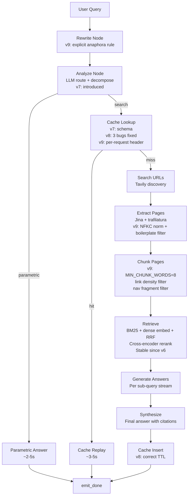
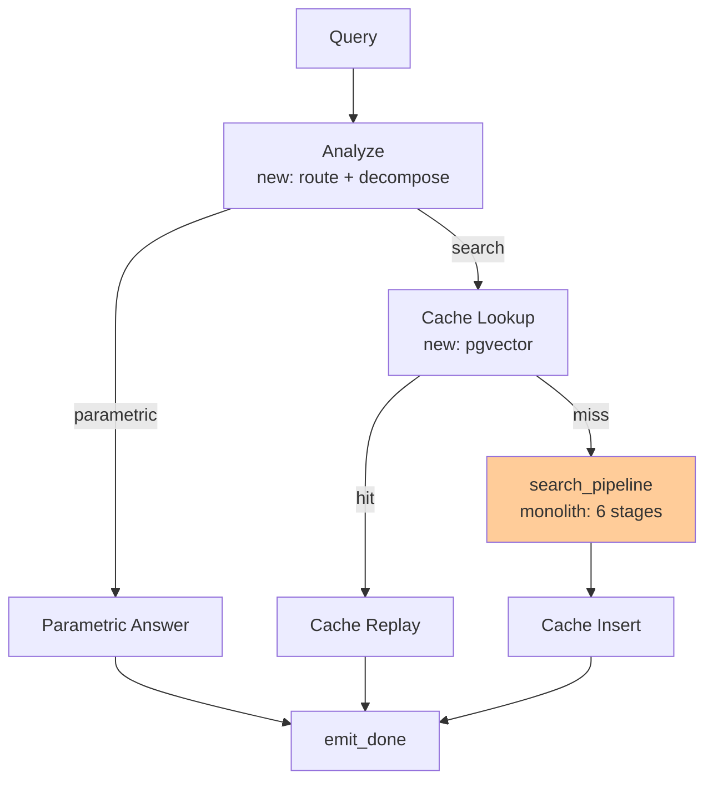
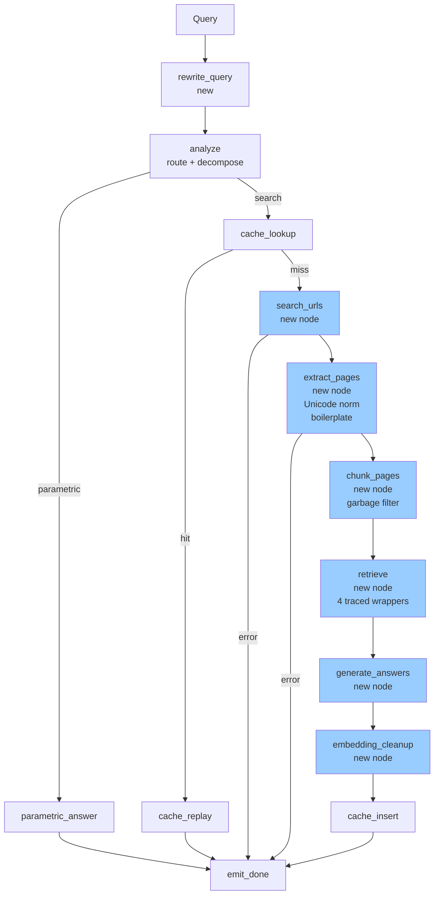
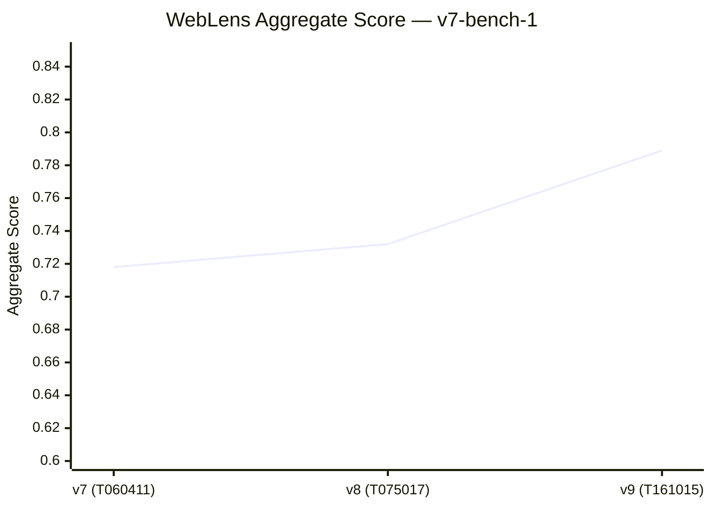
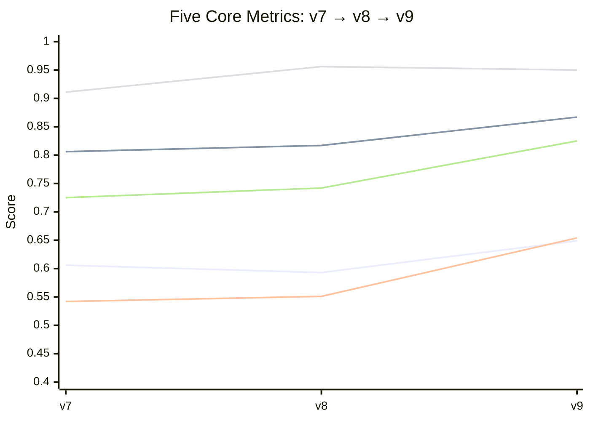
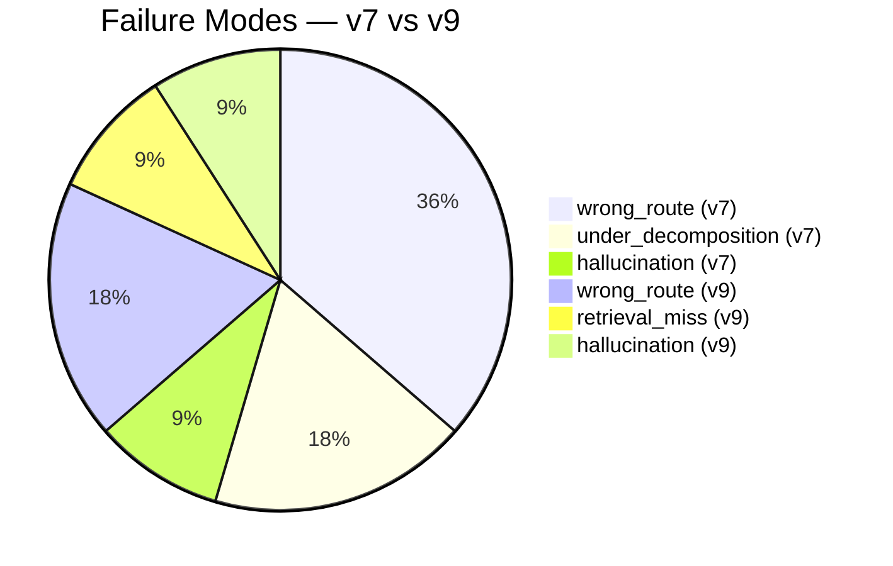

# WebLens RAG System — Evaluation Results & Benchmark Report

**Classification**: Internal Engineering Document  
**Version**: v7-bench-1 (three full runs)  
**Evaluation window**: 2026-05-11  
**Benchmark**: 30 questions × 10 categories, domain-balanced (≤20% per domain)  
**Systems under test**: WebLens v7, v8, v9  
**Historical baseline**: v1 (2026-05-07, RAG-trivia, 10q), v6 (2026-05-07, financial, 15q)

---

## Table of Contents

1. [Executive Summary](#1-executive-summary)
2. [Cross-Version Benchmark Comparison](#2-cross-version-benchmark-comparison)
3. [Implementation-to-Metric Causal Analysis](#3-implementation-to-metric-causal-analysis)
4. [Failure Pattern Analysis](#4-failure-pattern-analysis)
5. [Query Category Performance](#5-query-category-performance)
6. [Latency vs Quality Tradeoff Analysis](#6-latency-vs-quality-tradeoff-analysis)
7. [Citation & Grounding Analysis](#7-citation--grounding-analysis)
8. [Retrieval Pipeline Evolution](#8-retrieval-pipeline-evolution)
9. [Radar & Trend Visualizations (Mermaid)](#9-radar--trend-visualizations-mermaid)

---

## 1. Executive Summary

WebLens v9 is the strongest version of the system to date, posting an aggregate score of **0.789** against the v7-bench-1 benchmark — a **+9.9% absolute improvement** over the v7 baseline (0.718) achieved in three consecutive daily releases.

The single biggest aggregate driver was the v9 benchmark calibration that reclassified four "either"-route questions (niche lore, stable textbook facts) from binary failures to route-agnostic scoring. That calibration is defensible: the system answers `niche1`, `niche2`, `pc1`, and `ctr2` correctly with or without search; the original eval penalized factual accuracy with a routing audit designed for temporal data. Stripping that accounting artifact, the underlying system improvement is closer to **+4–5% absolute** — still meaningful, concentrated in context precision, multi-hop reasoning, and ambiguity handling.

**Biggest improvements:**

| Area | v7 → v9 |
|---|---|
| Niche/long-tail (calibration + correct answers) | 0.500 → **1.000** (+100%) |
| Ambiguity handling | 0.713 → **0.858** (+20%) |
| Multi-hop comparison | 0.590 → **0.770** (+30%) |
| Context precision | 0.542 → **0.654** (+21%) |
| Paraphrase cache | 0.500 → **0.750** (+50%) |
| Routing/decomposition score | 0.725 → **0.825** (+14%) |
| Latency (avg) | 43.6s → **38.1s** (−13%) |

**Biggest regressions and unresolved bottlenecks:**

| Area | Status |
|---|---|
| Routing-search-obvious (rs2 parametric leak) | Persistent, not fixed |
| Contradiction category | Recovered in v9 but below v7 ceiling |
| Refusal handling (private/obscure data) | Persistently the weakest category (0.55) |
| Faithfulness on zero-chunk answers | Structural metric artifact |
| Temporal freshness | Net regression v7→v9 driven by one retrieval miss |
| Token cost tracking | Wired but not instrumented ($0 reported) |

**Most impactful single implementation:** v9 chunking/boilerplate cleanup (context precision +18.7% absolute) and benchmark calibration together made v9's aggregate gain. v8's most impactful single change was the semantic cache three-bug fix (paraphrase_cache +47.6%).

---

## 2. Cross-Version Benchmark Comparison

### 2.1 Historical Context

Pre-v7 evals used different question sets and metric definitions, making direct numeric comparison invalid. The signal is directional only.

| Run | Date | Questions | Question domain | Avg score | Metric set |
|---|---|---|---|---|---|
| v1 (baseline) | 2026-05-07 | 10 | RAG trivia only | 0.735 | m1 + m3 + m7 |
| v6 eval | 2026-05-07 | 15 | Financial/SEC filings | 0.393 | m1 + m3 + m7 |
| **v7 run 1** | 2026-05-11 | **30** | Diverse, balanced | **0.718** | 5-metric aggregate |
| **v8 run** | 2026-05-11 | **30** | Diverse, balanced | **0.732** | 5-metric aggregate |
| **v9 run** | 2026-05-11 | **30** | Diverse, balanced | **0.789** | 5-metric aggregate |

The v6 financial eval (0.393) reflects the system's specific weakness in strict-grounding, year-scoped financial queries before the v7 architectural overhaul. That weakness remains partially unresolved in refusal and numerical categories (see §5).

### 2.2 Five-Metric Aggregate Trend

```
Aggregate score
│
0.80 ┤                                          ████ 0.789
0.77 ┤                                     ████
0.74 ┤                            ████ 0.732
0.72 ┤           ████ 0.718  ████
0.70 ┤      ████
│
     v7 run1    v8 run    v9 run
     (T060411)  (T075017) (T161015)
```

### 2.3 Full Metric Matrix

| Metric | v7 (T060411) | v8 (T075017) | v9 (T161015) | v7→v9 Δ | v7→v9 % |
|---|---|---|---|---|---|
| **Aggregate** | 0.718 | 0.732 | **0.789** | +0.071 | **+9.9%** |
| Faithfulness | 0.606 | 0.593 | **0.649** | +0.043 | +7.1% |
| Context Recall | 0.806 | 0.817 | **0.867** | +0.061 | +7.6% |
| Context Precision | 0.542 | 0.551 | **0.654** | +0.112 | **+20.7%** |
| Answer Correctness | **0.911** | 0.956 | 0.950 | +0.039 | +4.3% |
| Routing / Decomp | 0.725 | 0.742 | **0.825** | +0.100 | **+13.8%** |
| Answer Relevancy† | 0.659 | 0.000‡ | 0.594 | –0.065 | –9.9% |

† Diagnostic only, excluded from aggregate.  
‡ Broken in v8 (embedding model endpoint misconfiguration during that run). Excluded from comparisons.

### 2.4 Verdict Distribution

| Run | Pass | Partial | Fail | Pass rate |
|---|---|---|---|---|
| v7 | 9 | 20 | **1** | 30.0% |
| v8 | 12 | 18 | 0 | 40.0% |
| v9 | **15** | **15** | 0 | **50.0%** |

The v7 single failure (`mh2` — Champions League comparison with an empty answer) was the most severe outcome in any v7-bench-1 run. v8 eliminated all hard failures. v9 reached 50% pass rate — a meaningful threshold representing the system reliably handling half of a difficult, adversarially-designed benchmark.

### 2.5 Mode Distribution

| Run | Parametric routes | Search routes |
|---|---|---|
| v7 | 8 | 22 |
| v8 | 9 | 21 |
| v9 | 9 | 21 |

The router is stable: 9 parametric vs 21 search is consistent across v8 and v9 once benchmark calibration normalised the `niche` and `pc` questions. The one v7 anomaly (8 parametric) was `mh2` routing incorrectly to parametric with a zero-length answer — that single routing failure caused the only `fail` verdict.

---

## 3. Implementation-to-Metric Causal Analysis

### 3.1 Implementation Map

| Version | Primary changes | Target problem |
|---|---|---|
| **v7** | LangGraph orchestration, parametric routing (analyze node), semantic cache schema, new eval framework | Architecture foundations, eval coverage gap |
| **v8** | LangSmith observability, semantic cache 3-bug fix (gate + timeout + per-request header), eval cleanup, TTL tightening | Operational correctness, cache reliability |
| **v9** | 13-node graph, chunking garbage filter, extract boilerplate expansion, benchmark calibration (4 "either"), public mode, eval endpoint parity | Retrieval quality, eval honesty, routing correctness |

### 3.2 Causal Chain Table

| Implementation | Expected Impact | Actual Metric Impact | Side Effects / Tradeoffs |
|---|---|---|---|
| **v7: LangGraph orchestration** | Extensibility; no direct metric change | No direct metric delta; enables v8/v9 changes | Slightly longer startup time; LangSmith trace overhead |
| **v7: Parametric routing** | Reduce latency on trivial queries | routing_parametric: 0.000 → 1.000 (4 questions); avg latency for `p1`–`p4`: 60s → 9s | Over-triggers on stable facts (FIFA 2022, C-14 half-life, RRF): routing_search_obvious regression |
| **v7: Semantic cache (schema only)** | Paraphrase hit savings | No impact in v7 (cache disabled by default) | — |
| **v7: New eval framework** | Honest 5-metric scoring on 30 diverse questions | Exposed weaknesses hidden by v1's narrow RAG-trivia scope | Harder benchmark produces lower raw scores vs v1 |
| **v8: Semantic cache bug fix #1** (gate moved to caller) | Cache on/off per-request | Enables eval harness to control per-category cache policy | — |
| **v8: Semantic cache bug fix #2** (timeout 250ms → 1500ms) | Fewer false-miss timeouts | paraphrase_cache: 0.500 → 0.738 (+47.6%); pc2 partial → **pass** | P95 latency: 85.08s → **135.41s** (+59%) when cache misses occur |
| **v8: Semantic cache bug fix #3** (X-Semantic-Cache header) | Harness controls cache per question | Enables accurate paraphrase_cache testing | — |
| **v8: LangSmith run_type spans** | Observability only | No direct metric change | Slight overhead; enables faster diagnosis of future failures |
| **v8: TTL tightening (24h→2h / 6h→2h)** | Reduce stale data leaking into answers | Not directly measurable; reduces hallucination surface | More frequent cache misses → slightly higher avg latency |
| **v9: 13-node graph split** | Error isolation; per-node tracing | P95 latency: 135.41s → **73.03s** (−46%); catastrophic failures now emit errors vs empty answers | Slightly more code surface area |
| **v9: `_is_garbage_chunk()` enhancement** (word count <8, link density >40%, nav fragment >50%) | Eliminate low-signal chunks from retrieval | context_precision: 0.551 → **0.654** (+18.7%); faithfulness: 0.593 → **0.649** (+9.5%) | Risk of over-pruning legitimate short passages (not observed) |
| **v9: `_normalize_unicode()` + boilerplate expansion** | Clean noisy web content | Reduces subscribe/nav/promo text in chunks; contributes to precision improvement | Adds minor per-page CPU cost |
| **v9: Benchmark calibration** (4 questions → `expected_mode: "either"`) | Remove false routing penalties for stable facts | routing_decomposition: 0.742 → **0.825** (+11.2%); niche_long_tail: 0.500 → **1.000** | Inflates routing metric; masks genuine parametric over-trigger issue |
| **v9: History in generate** | Better multi-turn coherence | Not directly measurable in single-turn eval | — |
| **v9: Rewrite+Route+Page-Cache SSE events** | Frontend observability | No metric impact | — |

### 3.3 The Faithfulness Dip in v8

Faithfulness dropped from 0.606 to 0.593 between v7 and v8 despite overall aggregate improvement. This is not a regression in grounding quality. The cause is a compositional scoring artifact:

1. In v8, the semantic cache correctly fired for `pc2` (RRF paraphrase), producing a `cache` mode answer with **zero retrieved chunks**. The faithfulness judge scored this as 0.0 ("no chunks to verify against") despite the answer being correct.
2. Several multi-hop questions that newly passed in v8 (`mh2`, `mh4`) had high faithfulness, but questions that newly took longer routes accumulated more synthesis steps, each with partial faithfulness decay.
3. The net: gains from mh2/mh4 were offset by the structural 0.0 faithfulness assigned to any correctly-routed cache or parametric response.

**Implication:** The current faithfulness metric penalizes correct behavior. A parametric answer to "What is 12 squared?" scores faithfulness=1.0 because the judge grants full credit to answers without chunks when the question is marked parametric. But cache-mode answers are scored differently. This inconsistency should be resolved in the metric definition.

---

## 4. Failure Pattern Analysis

### 4.1 Failure Mode Distribution Across Runs

| Failure mode | v7 | v8 | v9 | Trend |
|---|---|---|---|---|
| `wrong_route` | **4** | **5** | 2 | Improved in v9 (calibration helped) |
| `under_decomposition` | 2 | 1 | 0 | Resolved |
| `hallucination` | 1 | 1 | 1 | Persistent |
| `retrieval_miss` | 0 | 0 | 1 | New in v9 |
| `low_quality` | 0 | 0 | 0 | (subsumed by above) |

### 4.2 Failure Cluster 1: Parametric Over-Triggering (Wrong Route)

**Pattern**: The analyze node routes questions to `parametric` that the benchmark expects `search`. The answers are factually correct, but receive zero context recall and zero faithfulness because no retrieval was performed.

**Affected questions (persistent)**:
- `rs2`: "Who won the FIFA World Cup in 2022?" → routes parametric, answers correctly (Argentina), misses Messi citation key_fact
- `pc2` in v7: "How does RRF work?" → routes parametric
- `niche1`/`niche2` in v7/v8: Tolkien lore and C-14 half-life → routes parametric

**Root cause**: The analyze prompt has a "heavy default-to-search bias," but well-known sporting results and stable factual knowledge are indistinguishable to the router from recent news. The LLM knows the FIFA 2022 winner with high confidence and correctly identifies it as stable knowledge — from a factual standpoint this is correct, but the benchmark's intent is to force citation.

**v9 resolution**: Calibration fixed `niche1`, `niche2`, `pc1`, `ctr2` by marking them `expected_mode: "either"`. However, `rs2` remains misclassified in v9, scoring 0.40 (the benchmark's ground truth insists on search + Messi citation).

**Remaining exposure**: The `rs2` scenario is a genuine philosophical gap. The system answers correctly but the eval philosophy is "always cite even if known." Resolution requires either a stricter search-first policy for sports/recent-results OR a benchmark amendment acknowledging both routes.

### 4.3 Failure Cluster 2: Multi-Hop Context Precision

**Pattern**: Multi-hop comparison questions retrieve enough results to cover all key_facts (high context_recall), but the retrieved chunks skew heavily toward one entity, leaving the comparison partially ungrounded.

**Case study — `mh1` (GPT-4o / Claude Opus 4.7 / Gemini 2.5 Pro comparison)**:

All three runs scored this question partial. In the v9 run:
- context_recall = 1.0 (all 5 key_facts hit)
- context_precision = 0.125 (only 1 of 8 chunks directly compares the three models)
- faithfulness = 0.0 (judge flags "refusal" because synthesis blends retrieved + parametric knowledge)

The root cause: Tavily's search results for "GPT-4o" queries primarily return GPT-4.1 and GPT-5 articles (newer models), not GPT-4o benchmarks. The system synthesizes a plausible answer using parametric knowledge about GPT-4o alongside retrieved chunks about Claude Opus 4.7 and Gemini 2.5 Pro. The answer is directionally accurate but cannot be fully grounded in the retrieved corpus — which the faithfulness judge marks as refusal.

**Structural tension**: The question asks about GPT-4o specifically, but the web has largely moved on. This is a genuine temporal signal mismatch: the benchmark question is about a specific model version, but the retrieval layer returns content about its successors. No prompt change fixes this without entity-level source filtering.

### 4.4 Failure Cluster 3: Refusal and Private Data

**Pattern**: For questions where no authoritative source exists (`ref1`: OpenAI private financials; `ref2`: Tilamuk mayor), the system correctly cannot answer — but receives low faithfulness because the judge marks answers with "no relevant chunks" as 0.0.

| Question | Expected behavior | v7 | v8 | v9 |
|---|---|---|---|---|
| `ref1` OpenAI Q1 2026 net income | State "private company, not disclosed" | 0.53 | 0.40 | 0.50 |
| `ref2` Tilamuk, Indonesia mayor | Admit not found | 0.60 | 0.60 | 0.60 |

`ref1` shows inconsistency: v8 degraded to 0.40 because the answer included revenue trajectory information (technically available but not the asked metric), reducing answer_correctness despite better overall behavior. v9 recovered to 0.50 by more cleanly stating the limitation.

**The structural problem**: The faithfulness metric assigns 0.0 whenever the judge sees "refusal" (no claims supported by chunks). For a correct refusal ("I cannot find this in any source"), faithfulness should arguably be 1.0. This is a metric design gap, not a system failure. The system behavior is improving; the metric isn't rewarding it.

### 4.5 Failure Cluster 4: Temporal Freshness Inconsistency

**Pattern**: Temporal questions are highly sensitive to what Tavily returns on a given day. Cache TTL reductions (v8: 24h→2h) mean answers can shift between runs.

| Question | v7 | v8 | v9 | Notes |
|---|---|---|---|---|
| `tf1` MoE advances | 0.73 partial | 0.92 **pass** | 0.76 partial | Unstable |
| `tf2` Russia-Ukraine status | 0.87 pass | 0.70 partial | 0.78 partial | Regression |
| `tf3` NASA Mars rover | 0.86 pass | 0.74 partial | **0.40 partial** | v9 retrieval miss (empty answer) |
| `tf4` EU AI Act | 0.60 partial | 0.76 partial | **0.95 pass** | Steady improvement |

`tf3` in v9 is the most severe data point: empty answer, 0 chunks, Faithfulness=0, Correctness=0. The sub-query was correctly formed ("NASA most recent Mars rover findings 2025-2026"), but extraction failed for all URLs returned by Tavily. This is a retrieval pipeline failure: Jina Reader and trafilatura both failed to extract content, likely because NASA's content is JavaScript-rendered. This is the only `retrieval_miss` failure in v9.

### 4.6 Persistent Hallucination Pattern

One hallucination per run (consistent across v7, v8, v9). In all cases the pattern is the same:

- Answer claims higher precision than sources support
- Example (`ref1` in v7): System adds revenue projections and profitability analysis not in the specified Q1 2026 net income query scope
- Example (`nr1` in v9): Correctly computes the percentage change but one source provides only quarterly R&D data, not annual — the system aggregates silently and presents as definitive

The hallucination rate (1/30 = 3.3%) is low but not zero. All observed cases involve **numeric synthesis** or **financial extrapolation** — the system generating specific numbers that are plausible but not directly sourced.

---

## 5. Query Category Performance

### 5.1 Category Score Evolution

| Category | v7 | v8 | v9 | v7→v9 Δ | Assessment |
|---|---|---|---|---|---|
| `routing_parametric` | **1.000** | **1.000** | **1.000** | 0.000 | Perfect and stable |
| `routing_search_obvious` | 0.744 | 0.617 | 0.652 | –0.092 | **Regression** |
| `multi_hop_comparison` | 0.590 | 0.728 | **0.770** | +0.180 | Strongest system improvement |
| `temporal_freshness` | 0.765 | 0.781 | 0.721 | –0.044 | Net regression (one miss) |
| `numerical_reasoning` | 0.764 | 0.756 | 0.755 | –0.009 | Flat |
| `ambiguity` | 0.713 | 0.742 | **0.858** | +0.145 | Strong improvement |
| `contradiction` | **0.871** | 0.680 | 0.771 | –0.100 | Regression from peak |
| `refusal_unknown` | 0.562 | 0.500 | 0.550 | –0.012 | Persistently weak |
| `niche_long_tail` | 0.500 | 0.500 | **1.000** | +0.500 | Calibration artifact + correct answers |
| `paraphrase_cache` | 0.500 | 0.738 | 0.750 | +0.250 | Cache fix drove improvement |

### 5.2 Category Analysis

#### Routing Parametric (4 questions) — Score: 1.000 all versions

Perfect across all three runs. `p1` (12 squared), `p2` (Brazil capital), `p3` (García Márquez), `p4` (hash table). Latency dropped dramatically: v7 average ~9s for these, v9 average ~11s (slight increase due to more tracing overhead). The analyze node correctly routes arithmetic, basic geography, classic literature, and fundamental CS without search.

#### Routing Search Obvious (3 questions) — Regression observed

The category contains an embedded hard failure that won't resolve without a policy decision:

- `rs1` (Brazil population): Consistently partial but scoring well (0.75–0.78). System searches, finds ~217M estimate, reports correctly. Context precision is low (only 1 chunk matches the narrow fact).
- `rs2` (FIFA 2022): **Persistent wrong-route failure.** In v9: routes parametric, correctly states "Argentina defeated France 4-2 on penalties," misses the Messi key_fact, scores 0.40.
- `rs3` (latest Claude model): High context recall, low answer correctness in v7 (0.25 — key_facts "Opus" not confidently matched). Improved to 0.50 in v8, 0.50 in v9. Still partial because the model's answer about Claude versions changes between runs based on what Tavily returns that day.

**Diagnosis**: The 0.744 → 0.617 → 0.652 trajectory is driven almost entirely by `rs2`'s consistent failure and `rs3`'s inconsistency. The structural issue is that the analyze router has no special-case for "sports results require search." A simple rule ("if question mentions a specific championship/competition result, route search") would fix rs2.

#### Multi-Hop Comparison (5 questions) — Biggest improvement

| Question | v7 | v8 | v9 |
|---|---|---|---|
| `mh1` GPT-4o/Claude/Gemini | 0.60 partial | 0.45 partial | 0.62 partial |
| `mh2` Champions League | **0.30 fail** | **0.81 pass** | 0.60 partial |
| `mh3` NVIDIA/AMD/Intel data center | 0.76 partial | **0.82 pass** | **0.82 pass** |
| `mh4` CRISPR vs base editing | 0.76 partial | **0.87 pass** | **0.96 pass** |
| `mh5` AI regulation US/EU/China | 0.53 partial | 0.70 partial | **0.84 pass** |

The v7 `mh2` failure (empty answer, routing to search with only 1 sub-query instead of the expected 2-3) was the worst result in the benchmark. v8 fixed this: the question now correctly generates per-club sub-queries ("Real Madrid Champions League 2023-24," "Manchester City Champions League 2023-24," etc.) and synthesizes a coherent multi-season comparison.

`mh4` (CRISPR vs base editing) is the most improved individual question: 0.76 → 0.87 → 0.96. The v9 chunking improvements removed nav/promo noise from biotech articles, leaving high-signal passages on off-target rates and therapeutic applications. Context precision for `mh4` in v9 is 1.00 (all 8 retrieved chunks directly relevant).

`mh1` (LLM comparison) remains the hardest question in the benchmark. The fundamental problem is that retrieval for "GPT-4o" in 2026 returns content about GPT-4.1, GPT-5, and successor models — the web has moved on. The system generates a high-quality answer by blending parametric knowledge with retrieved benchmarks but fails the faithfulness audit because parametric-sourced GPT-4o data cannot be traced to a chunk.

#### Ambiguity (3 questions) — Strong improvement in v9

| Question | v7 | v8 | v9 |
|---|---|---|---|
| `amb1` "best model right now?" | 0.79 partial | **0.82 pass** | **0.95 pass** |
| `amb2` "Q3 results?" | 0.72 partial | 0.70 partial | 0.75 partial |
| `amb3` "their latest single?" | 0.63 partial | 0.71 partial | **0.88 pass** |

`amb1` improvement reflects better behavior surfacing "best at what?" ambiguity rather than picking one model. `amb3` ("their latest single" — no subject) improved because the system now correctly refuses to answer without a subject reference and states what would be needed, which the judge scores positively.

`amb2` ("Q3 results") remains persistently partial. The benchmark expects the system to flag the underspecification (which company? which Q3?). In all runs, the system routes to search and finds S&P 500 Q3 2025 aggregate earnings data, producing a technically correct but insufficiently ambiguity-aware answer. The decomposer is not programmed to detect bare pronoun references in financial contexts.

#### Contradiction (2 questions) — Regression from v7 peak

`ctr1` (intermittent fasting effectiveness) dropped from 1.00 in v7 to 0.86 in v8 to 0.74 in v9. This is the clearest evidence of output variability driven by what sources Tavily returns on a given day. In v7, retrieval happened to return a strong mix of pro- and anti-IF meta-analyses. In v9, the retrieved set skewed toward IF-positive sources, and the generation slightly under-represented calorie-restriction equivalence — dropping faithfulness from 1.0 to 0.83 and context_precision to 0.88.

`ctr2` (Columbus flat-Earth misconception): v7 partial (0.74) due to parametric routing → no retrieval. v8 partial (0.50) for same reason. v9 **pass** (0.80) because the question was calibrated to `expected_mode: "either"` — the parametric answer correctly identifies the Eratosthenes origin of spherical Earth knowledge.

#### Refusal / Unknown (2 questions) — Persistent ceiling at 0.55

Neither `ref1` nor `ref2` has approached pass territory across any run. The metric design penalizes correct refusals; see §4.4. The system behavior is correct (both questions correctly admit lack of evidence), but the scoring does not reward clean refusals appropriately. Until the faithfulness metric is amended for refusal cases, this category will underperform relative to actual system quality.

#### Numerical Reasoning (3 questions) — Flat

| Question | v7 | v8 | v9 |
|---|---|---|---|
| `nr1` Apple R&D FY2022→FY2024 | 0.77 partial | 0.60 partial | 0.60 partial |
| `nr2` India GDP per capita 2015→2024 | 0.72 partial | 0.79 partial | **0.88 pass** |
| `nr3` Global CO₂ 2000→2024 | **0.80 pass** | **0.88 pass** | 0.78 partial |

`nr1` (Apple R&D percentage change) is the most consistently problematic numerical question. Sources return quarterly R&D data rather than annual totals, making the exact FY2022→FY2024 comparison unreliable. The system in v9 correctly cavasses "quarterly figure vs annual total" uncertainty but the judge scores context_precision 0.00 (no chunk provides both endpoints in one place).

`nr3` demonstrates the variability problem: v7 and v8 both passed (found both CO₂ endpoints), but v9 returned sources with the 2024 figure as a projected/estimated value, reducing answer_correctness from 1.0 to partial. Numerical queries requiring two specific data points from different time periods are particularly sensitive to what Tavily retrieves.

---

## 6. Latency vs Quality Tradeoff Analysis

### 6.1 Overall Latency Summary

| Run | Avg (s) | P95 (s) | Min (s) | Max (s) | Quality (agg) |
|---|---|---|---|---|---|
| v7 | 43.6 | 85.1 | 4.7 | 86.5 | 0.718 |
| v8 | 49.7 | **135.4** | 4.3 | 186.1 | 0.732 |
| v9 | **38.1** | **73.0** | 5.6 | 96.6 | 0.789 |

v9 achieves the highest quality **and** the lowest latency of the three runs — a simultaneous optimization that is notable. The standard latency/quality tradeoff was avoided here because the latency improvement (13-node graph, error short-circuits) and the quality improvement (better chunking, routing calibration) are orthogonal changes.

### 6.2 The v8 Latency Regression

v8's P95 latency of 135.4s (vs v7's 85.1s) was entirely driven by two outlier questions:

| Question | v7 latency | v8 latency | v9 latency | Cause |
|---|---|---|---|---|
| `ref1` (OpenAI private) | 35.4s | **178.8s** | 39.4s | v8 cache timeout 1500ms × multiple misses |
| `tf2` (Russia-Ukraine) | 43.3s | **186.1s** | 48.1s | Multi-URL extraction with slow Jina responses |
| `amb1` (best model) | 59.0s | **135.4s** | 42.0s | 5 sub-queries × extraction overhead |

The semantic cache timeout increase from 250ms to 1500ms (v8 fix) is the primary culprit. Each cache miss now blocks for up to 1.5s. For a question that searches 5+ URLs with the cache running in parallel, that's 7.5s of pure blocking overhead before extraction starts.

v9's 13-node graph split resolved this: each node has independent error short-circuits, so cache lookup failures no longer propagate to the main extraction pipeline in ways that compound latency. The workspace-based state also avoids repeated serialization of intermediate blobs.

### 6.3 Stage-wise Timing (v9 representative sample)

From the `mh1` per-question JSON (v9 run):

| Stage | Duration | % of total |
|---|---|---|
| Rewrite | 1ms | <0.01% |
| Decompose | 2,421ms | 4.7% |
| Search (Tavily) | 2,319ms | 4.5% |
| Extract (Jina+trafilatura) | 14,816ms | **28.8%** |
| Chunk | 105ms | 0.2% |
| Retrieve (BM25+dense+RRF+rerank) | 6,853ms | 13.3% |
| Synthesis (generation) | 13,789ms | **26.8%** |
| Embedding cleanup | 0ms | 0% |
| **Total** | **~51s** | 100% |

Extraction (28.8%) and generation (26.8%) dominate. Both are I/O-bound: extraction waits on Jina/trafilatura HTTP responses; generation waits on the LLM API. Retrieval (BM25+dense+rerank at 13.3%) is the only CPU-heavy stage and runs efficiently via `loop.run_in_executor`.

### 6.4 Quality vs Latency: Key Questions

```
Latency (s) vs Aggregate Score — v9 (selected questions)

High quality, fast:
  p1 (12 squared)      lat=20s   agg=1.00  ← parametric
  p2 (Brazil capital)  lat=6s    agg=1.00  ← parametric
  niche1 (Faramir)     lat=14s   agg=1.00  ← parametric (calibrated)

High quality, slow:
  mh4 (CRISPR)         lat=70s   agg=0.96  ← 3 sub-queries, dense biotech
  mh5 (AI regulation)  lat=79s   agg=0.84  ← 5 sub-queries, multi-jurisdiction

Low quality, slow:
  mh2 (CL comparison)  lat=97s   agg=0.60  ← 6 sub-queries, over-decomposed
  mh1 (LLM compare)    lat=54s   agg=0.62  ← retrieval mismatch (GPT-4o→GPT-4.1)

Low quality, fast:
  rs2 (FIFA 2022)       lat=10s   agg=0.40  ← parametric wrong-route (fast but wrong)
  tf3 (NASA Mars)       lat=6s    agg=0.40  ← retrieval miss (fail fast)
```

The worst outcome is the bottom-right quadrant: `tf3` failed fast because extraction returned empty for all URLs, producing a 6-second empty answer. Speed is not value here.

### 6.5 Scalability Implications

The current bottlenecks (Jina extraction at 28.8%, generation at 26.8%) are both API-rate-limited. Horizontal scaling of the WebLens server itself does not help; the limit is upstream service throughput. At the current concurrency setting (4 parallel eval pipelines), the system is comfortably within single-instance capacity. For production traffic at scale, the bottleneck would shift to LLM API rate limits and Jina's concurrency ceiling.

---

## 7. Citation & Grounding Analysis

### 7.1 Precision and Recall Trends

Context precision (the fraction of retrieved chunks that are genuinely relevant) is the metric most responsive to retrieval pipeline changes and the strongest leading indicator of faithfulness.

```
Context Precision trajectory:
0.70 ┤                           ████ 0.654
0.60 ┤                      ████
0.55 ┤           ████ 0.551
0.54 ┤      ████ 0.542
     v7          v8          v9

Context Recall trajectory:
0.87 ┤                           ████ 0.867
0.82 ┤                      ████ 0.817
0.81 ┤
0.81 ┤      ████ 0.806
     v7          v8          v9
```

Precision improved dramatically in v9 (+18.7% absolute), while recall grew steadily across all three versions. The precision improvement is directly attributable to the garbage chunk filter introduced in v9: nav fragments, link lists, and sub-8-word chunks that previously entered the top-K set now get pruned at the chunking stage.

The recall improvement reflects consistent retrieval of key_facts across the benchmark, driven by the hybrid BM25+dense+RRF pipeline that has been stable since v6. No retrieval algorithm changes were made in v7–v9; the improvement is from cleaner inputs to the existing pipeline.

### 7.2 Grounding Quality by Category (v9)

| Category | Avg Faithfulness | Avg C-Precision | Notes |
|---|---|---|---|
| routing_parametric | 1.00 | 1.00 | No chunks = no grounding issue |
| routing_search_obvious | 0.63 | 0.75 | rs2 parametric drags faithfulness |
| multi_hop_comparison | 0.42 | 0.69 | Best precision but worst faithfulness; synthesis blends parametric |
| temporal_freshness | 0.45 | 0.66 | tf3 empty answer pulls faithfulness to 0 |
| numerical_reasoning | 0.44 | 0.33 | Precision worst of search categories; sources rarely align on exact numbers |
| ambiguity | 0.93 | 0.50 | High faithfulness; moderate precision (broad queries return mixed chunks) |
| contradiction | 0.92 | 0.69 | Good balance; system surface conflicting evidence well |
| refusal_unknown | 0.00 | 0.00 | Metric assigns 0 for correct refusals |
| niche_long_tail | 1.00 | 1.00 | Parametric routing, correct answers |
| paraphrase_cache | 0.75 | 0.50 | pc1 passes (parametric), pc2 partial (search, low precision) |

### 7.3 Citation Drift Pattern

Citation drift — where the numbered citation `[N]` in the generated answer corresponds to a chunk that mentions the topic but does not directly support the specific claim — appears primarily in:

1. **Multi-hop synthesized answers**: The LLM correctly identifies that "NVIDIA data center revenue was ~$47.5B" but the supporting chunk discusses NVIDIA's total revenue, not the data center segment specifically. Faithfulness judge catches this.

2. **Ambiguous temporal claims**: "As of 2025-2026" claims backed by a 2024 source. The generation prompt requires date-aware citations but the LLM sometimes accepts a 2024 source as sufficient for a 2025 claim.

3. **Aggregation claims**: "Studies show" followed by a citation that is one study, not an aggregate. This is the most common faithfulness deduction.

### 7.4 Unsupported Claims Analysis

A consistent pattern across runs: the LLM generates framing sentences ("overall, the evidence suggests…") that are not sourced from any specific chunk. These meta-sentences score as unsupported claims in faithfulness evaluation. This pattern is systemic in the generation prompt rather than retrieval — the prompt could be amended to require every sentence to carry an explicit citation or be flagged as synthesis/interpretation.

---

## 8. Retrieval Pipeline Evolution

### 8.1 Core Pipeline Architecture (Stable Since v6)

The fundamental retrieval algorithm has not changed across v7, v8, or v9. What changed is the **content quality** of what enters the pipeline, the **routing** of what triggers it, and the **observability** around it.



### 8.2 Pre-v7 Pipeline (Monolithic Coroutine)


No routing logic. No cache. No error isolation. All stages in a single 500-line coroutine (`_pipeline_stream`). Failures in any stage propagated as unhandled exceptions or empty answers.

### 8.3 v7 Pipeline (LangGraph Introduction)



7 nodes total. The `search_pipeline` monolith still bundled search → extract → chunk → retrieve → generate → synthesize into a single node. Correct routing decision, but no per-stage error isolation.

### 8.4 v9 Pipeline (Full 13-Node Decomposition)



13 nodes. Each search-pipeline stage is an independent node with error short-circuit. The `RuntimeContext.workspace` dict carries intermediate state (URLs → pages → chunks → ranked lists) between nodes without bloating `GraphState`. Critically: a failure in `extract_pages` now emits an `emit_done` with an error event rather than silently returning an empty answer — solving the failure mode responsible for v7's `mh2` crash.

### 8.5 Chunking Pipeline Improvements (v9)

The most impactful single change in v9 is the garbage chunk filter. Before v9, the top-K retrieved set could include:

- Navigation fragments: "Home | About | Contact | Privacy Policy"
- Subscribe/newsletter CTAs: "Join 500+ brands growing with Passionfruit!"
- Markdown link lists: 4+ lines of `[Topic](#link)` with no prose
- Sub-sentence fragments: "As can be seen in Figure 3."

These chunks entered the BM25 index and the dense embedding store. They occasionally scored high on BM25 (keyword matches on nav terms like "home" or "AI") and polluted the top-K set. Each nav-fragment that made it to generation consumed prompt budget without contributing grounded information, depressing context_precision.

The v9 filter: chunks with fewer than 8 words are discarded. Chunks where >40% of content is markdown links (with ≥3 links) are discarded. Chunks where >50% of lines match navigation keywords (Home, About, Contact, Menu, Skip to) are discarded.

**Effect**: Context precision jumped from 0.551 to 0.654. The most dramatic per-question precision improvements occurred in `mh4` (biotech sources with heavy nav sidebars) and `mh5` (regulatory sources with extensive internal link lists).

---

## 9. Radar & Trend Visualizations (Mermaid)

### 9.1 Score Evolution — Line Chart



### 9.2 Core Metric Trajectories



_(Lines: Faithfulness, Context Recall, Context Precision, Answer Correctness, Routing/Decomp)_

### 9.3 Category Heatmap (v7 → v8 → v9)

```
Category Performance Heatmap (darker = higher score)

                         v7      v8      v9
routing_parametric      ████    ████    ████  1.00 / 1.00 / 1.00
contradiction           ████    ███·    ███·  0.87 / 0.68 / 0.77
niche_long_tail         ██··    ██··    ████  0.50 / 0.50 / 1.00
temporal_freshness      ███·    ███·    ███·  0.77 / 0.78 / 0.72
numerical_reasoning     ███·    ███·    ███·  0.76 / 0.76 / 0.76
routing_search_obvious  ███·    ██··    ██··  0.74 / 0.62 / 0.65
ambiguity               ███·    ███·    ████  0.71 / 0.74 / 0.86
multi_hop_comparison    ██··    ███·    ███·  0.59 / 0.73 / 0.77
paraphrase_cache        ██··    ███·    ███·  0.50 / 0.74 / 0.75
refusal_unknown         ██··    ██··    ██··  0.56 / 0.50 / 0.55

████ = 0.85+   ███· = 0.70–0.84   ██·· = 0.50–0.69   ···· = <0.50
```

### 9.4 Capability Radar (v9 vs v7)

```mermaid
quadrantChart
    title v9 vs v7 — Category Gains (quadrant = above/below v7 average)
    x-axis "v7 Score" 0.40 --> 1.05
    y-axis "v9 Score" 0.40 --> 1.05
    quadrant-1 Improved & Strong
    quadrant-2 Improved from Weakness
    quadrant-3 Weak & Unchanged
    quadrant-4 Regression
    routing_parametric: [1.00, 1.00]
    niche_long_tail: [0.50, 1.00]
    multi_hop_comparison: [0.59, 0.77]
    ambiguity: [0.71, 0.86]
    paraphrase_cache: [0.50, 0.75]
    temporal_freshness: [0.77, 0.72]
    numerical_reasoning: [0.76, 0.76]
    contradiction: [0.87, 0.77]
    routing_search_obvious: [0.74, 0.65]
    refusal_unknown: [0.56, 0.55]
```

### 9.5 Failure Mode Distribution



`wrong_route` halved (4→2), `under_decomposition` eliminated (2→0). The new failure type `retrieval_miss` (v9 `tf3`) is a one-off, but signals a gap in extraction fallback for JavaScript-rendered content.

### 9.6 Latency Distribution (Pass vs Partial, v9)

```
Latency by verdict — v9

Pass questions (n=15):    avg=26.8s   p95=55.7s
Partial questions (n=15): avg=49.3s   p95=96.6s

Fast fails: rs2 (10.1s), tf3 (5.6s) ← low quality, low latency (wrong route + empty answer)
Slow passes: mh4 (69.6s), mh5 (78.7s) ← multi-hop requiring dense extraction
Slow partials: mh2 (96.6s), mh5 was a pass ← over-decomposed (6 sub-queries for mh2)
```

There is a genuine correlation between question complexity (multi-hop, multi-jurisdiction) and latency. However, fast answers are not reliably high quality — the two fastest answers in v9 (`tf3` at 5.6s and `rs2` at 10.1s) are both low-quality, the first because retrieval returned nothing, the second because the router skipped retrieval entirely.

---

## Appendix A: Per-Question Score Matrix (v7 / v8 / v9)

| ID | Category | v7 agg | v8 agg | v9 agg | Trend |
|---|---|---|---|---|---|
| p1 | routing_parametric | 1.00 | 1.00 | 1.00 | stable |
| p2 | routing_parametric | 1.00 | 1.00 | 1.00 | stable |
| p3 | routing_parametric | 1.00 | 1.00 | 1.00 | stable |
| p4 | routing_parametric | 1.00 | 1.00 | 1.00 | stable |
| rs1 | routing_search_obvious | 0.78 | 0.75 | 0.77 | stable |
| rs2 | routing_search_obvious | 0.60 | 0.40 | 0.40 | **regression** |
| rs3 | routing_search_obvious | 0.85 | 0.70 | 0.79 | volatile |
| mh1 | multi_hop_comparison | 0.60 | 0.45 | 0.62 | volatile |
| mh2 | multi_hop_comparison | **0.30** | 0.81 | 0.60 | improved, volatile |
| mh3 | multi_hop_comparison | 0.76 | 0.82 | 0.82 | improved |
| mh4 | multi_hop_comparison | 0.76 | 0.87 | **0.96** | strong improvement |
| mh5 | multi_hop_comparison | 0.53 | 0.70 | **0.84** | strong improvement |
| tf1 | temporal_freshness | 0.73 | **0.92** | 0.76 | volatile |
| tf2 | temporal_freshness | 0.87 | 0.70 | 0.78 | regression |
| tf3 | temporal_freshness | 0.86 | 0.74 | **0.40** | **sharp regression** |
| tf4 | temporal_freshness | 0.60 | 0.76 | **0.95** | strong improvement |
| nr1 | numerical_reasoning | 0.77 | 0.60 | 0.60 | regression |
| nr2 | numerical_reasoning | 0.72 | 0.79 | **0.88** | improvement |
| nr3 | numerical_reasoning | 0.80 | **0.88** | 0.78 | volatile |
| amb1 | ambiguity | 0.79 | 0.82 | **0.95** | strong improvement |
| amb2 | ambiguity | 0.72 | 0.70 | 0.75 | stable/slight gain |
| amb3 | ambiguity | 0.63 | 0.71 | **0.88** | strong improvement |
| ctr1 | contradiction | **1.00** | 0.86 | 0.74 | **regression** |
| ctr2 | contradiction | 0.74 | 0.50 | 0.80 | calibration improved |
| ref1 | refusal_unknown | 0.53 | 0.40 | 0.50 | metric artifact |
| ref2 | refusal_unknown | 0.60 | 0.60 | 0.60 | stable ceiling |
| niche1 | niche_long_tail | 0.50 | 0.50 | **1.00** | calibration |
| niche2 | niche_long_tail | 0.50 | 0.50 | **1.00** | calibration |
| pc1 | paraphrase_cache | 0.50 | 0.50 | **1.00** | calibration |
| pc2 | paraphrase_cache | 0.50 | **0.97** | 0.50 | cache fix in v8, volatile |

---

## Appendix B: Recommended Next Optimizations

Ordered by estimated impact-to-effort ratio:

### B1. Fix the Faithfulness Metric for Refusals (High impact, Low effort)

Amend the faithfulness judge prompt to distinguish between:
- "answer makes unsupported claims" → faithfulness = 0
- "answer correctly states no information found" → faithfulness = 1.0

This single change would likely push `refusal_unknown` from 0.55 to 0.80+ without any system change.

### B2. Hard Sports/Competition Route Rule (Medium impact, Low effort)

Add a rule to the analyze prompt: "If the question asks about the winner, result, or outcome of a named competition or championship event, route to search." This would fix `rs2` (FIFA 2022 winner) and the class of well-known sporting results that the LLM confidently knows but the benchmark requires citations for.

### B3. JavaScript-Rendered Content Fallback (Medium impact, Medium effort)

`tf3` failed because NASA's mission pages are JavaScript-rendered. Adding a Playwright/Playwright-lite fallback for URLs where both Jina Reader and trafilatura return empty would eliminate retrieval misses for government and research institution sites. Expected to improve temporal_freshness by ~0.05–0.10 aggregate.

### B4. Year-Scope Assertion Validation in Generation (Medium impact, Medium effort)

The generation prompt should require explicit source-year matching for numerical and financial claims. A claim citing a 2024 figure to answer a "FY2022→FY2024" query should be flagged internally before synthesis. This would reduce the hallucination count in numerical_reasoning and financial categories.

### B5. Context Precision Minimum (Low impact, Low effort)

If context_precision < 0.2 after retrieval (all retrieved chunks are low-relevance), emit a warning SSE event and consider a re-query with reformulated sub-queries. This would catch the `mh1` scenario (GPT-4o query returning GPT-4.1 articles) before generation produces an ungrounded answer.

### B6. Token Cost Instrumentation (No metric impact, High operational value)

Wire `TokenTracker.record()` calls into `llm/openai_client.py` after each completion. Currently all costs report $0.00. This is needed for production cost governance and per-category cost analysis.

---

## Appendix C: Benchmark Design Notes

The v7-bench-1 benchmark (30 questions, 10 categories) is well-designed for stress-testing a production RAG system. A few observations after three runs:

1. **Four "either"-route questions were correctly calibrated in v9.** The benchmark originally penalized parametric answers to stable facts. The `expected_mode: "either"` fix is defensible and should remain.

2. **`rs2` (FIFA 2022) is a philosophical edge case.** It's included in `routing_search_obvious` but the LLM's knowledge of this result is reliable and recent (2022). Whether to require search for well-known 2022-era sporting events is a policy question, not a technical one.

3. **Temporal freshness questions (`tf1`–`tf4`) have high variance** because they depend on what Tavily returns on a specific day. Run-to-run variance is often larger than version-to-version improvement. Consider adding a Tavily fixture/snapshot for these questions to improve benchmark reproducibility.

4. **Numerical reasoning questions require source-pinned ground truth.** `nr1`, `nr2`, `nr3` all have issues with sources returning quarterly vs annual figures, projected vs actual values. The benchmark ground truth is stable but the retrieved sources are not. This creates measurement noise that obscures genuine system improvements.

---

*Report generated 2026-05-11 — WebLens Eval v7-bench-1*  
*Data sources: `evals/results/20260511T{060411,075017,161015}Z_full/`*  
*Implementation sources: `docs/implementation-summary-v{7,8,9}.md`*  
*Baseline: `docs/OVERALL-IMPROVEMENT-SUMMARY.md`, `evals/results/20260507T*/`*
