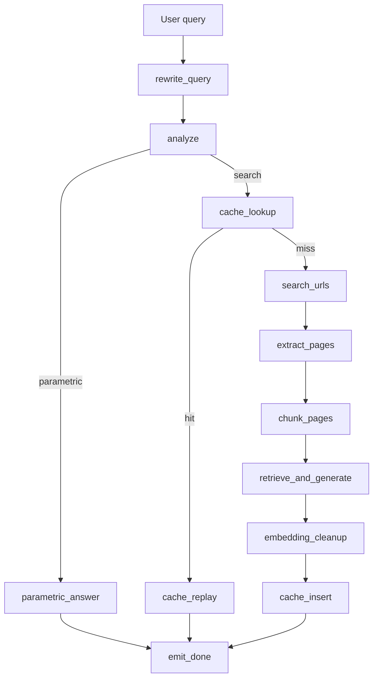

# WebLens Interview Guide

> Production-grade web-search RAG with LangGraph orchestration, full-page extraction, hybrid retrieval, streaming answers, semantic caching, LangSmith tracing, and an eval harness.

---

## 30-Second Pitch

WebLens answers natural-language questions from the live web. The core design choice is to retrieve full-page markdown instead of relying on search snippets, then chunk by heading boundaries, run hybrid BM25 + dense retrieval fused with RRF, rerank with a cross-encoder, and stream grounded answers with stable `[N]` citations.

The current backend is a 12-node LangGraph graph with conditional routing for parametric answers, semantic cache hits, and full web retrieval. Each node emits typed SSE events for the React UI and LangSmith spans for debugging. The v9 baseline eval scored 0.789 aggregate across 30 adversarial questions with zero hard failures.

---

## What The System Demonstrates

- LangGraph orchestration with explicit node boundaries and conditional edges
- LLM-based query rewrite, route classification, and decomposition in `pipeline/analyze.py`
- Semantic query cache using pgvector cosine thresholding
- Full-page extraction through Jina Reader with trafilatura fallback
- Heading-aware chunking with garbage filtering and deduplication
- Hybrid retrieval: BM25 + MiniLM dense vectors + RRF + TinyBERT cross-encoder reranking
- Concurrent SSE streaming for sub-query answers and final synthesis
- Session persistence with JSONB traces that replay the same reasoning UI later
- LangSmith tracing with typed spans for LLM, retriever, parser, and tool work
- Automated eval harness with 5 metrics and per-question failure analysis

---

## Architecture At A Glance

The graph has 12 nodes:

`rewrite_query -> analyze -> {parametric_answer | cache_lookup -> {cache_replay | search_urls -> extract_pages -> chunk_pages -> retrieve_and_generate -> embedding_cleanup -> cache_insert}} -> emit_done`

The important v12 change is `retrieve_and_generate`: retrieval and generation are fused per sub-query, so a sub-query starts streaming as soon as its own ranked chunks are ready instead of waiting for every other sub-query to finish retrieval.

---

## Request Lifecycle

1. `rewrite_query` resolves anaphora against recent conversation history and detects topic switches.
2. `analyze` asks the LLM for a JSON routing decision: `parametric`, `search`, or `unsupported`, plus sub-queries and rationale.
3. Parametric and unsupported responses stream immediately without web retrieval.
4. Search-path requests check the semantic query cache before hitting Tavily.
5. Tavily URL discovery runs for every sub-query in parallel, then URLs are deduplicated globally.
6. Page extraction runs once per unique URL, using page-cache hits where available.
7. Chunking preserves heading context and drops garbage, very short chunks, and duplicates.
8. `retrieve_and_generate` retrieves per sub-query and streams each answer through a multiplexed queue.
9. Multi-sub-query answers receive a synthesis pass that preserves citation numbers.
10. `embedding_cleanup`, `cache_insert`, and `emit_done` finalize metrics, cache writes, persistence, and SSE completion.

---

## Why Full-Page Extraction Matters

Snippet RAG has a hard information bottleneck: search snippets are short, often optimized for clicks, and usually omit caveats or nearby context. WebLens instead extracts full markdown, preserves headings, and cites ranked passages from the page body. This gives the retriever enough context to find precise evidence and gives the generator enough source material to avoid unsupported claims.

---

## Retrieval Design

WebLens uses a precision-oriented stack:

| Layer | Role |
|---|---|
| BM25 | Exact keywords, named entities, ticker symbols, technical terms |
| MiniLM dense vectors | Paraphrases and semantic similarity |
| RRF | Stable fusion without score calibration |
| TinyBERT cross-encoder | Final precision rerank over the top candidates |

Dense-only retrieval misses exact entity matches. BM25-only misses paraphrases. Cross-encoder-only retrieval is too expensive over a full corpus. The layered design gives good recall first, then spends the slower model only on a small candidate pool.

---

## Citation Strategy

Citations are assigned globally by URL before generation. The same `[3]` always points to the same source across a sub-answer and the synthesized final answer. The frontend can therefore render citation buttons reliably without remapping model output after the fact.

The generation layer also strips markdown links that are not in the retrieved citation pool. This is a small but useful guardrail against link hallucination.

---

## Caching Strategy

WebLens has two separate caches:

| Cache | Purpose | Key |
|---|---|---|
| `page_cache` | Avoid repeated page extraction | URL |
| `query_cache` | Replay semantically equivalent full answers | MiniLM query embedding with cosine >= 0.92 |

The semantic query cache is deliberately strict and has a 1500ms timeout. A cache miss should never materially slow down the live path.

---

## Observability

Each meaningful unit of work is visible in two places:

- The browser receives typed SSE events such as `rewrite_done`, `route_done`, `search_done`, `extract_done`, `retrieve_done`, `sub_answer_token`, and `done`.
- LangSmith receives typed spans for LLM, retriever, parser, and tool operations.

This makes the system explainable in an interview: you can show the route decision, decomposition, URL set, retrieved chunks, generation latency, and final persisted trace for a single request.

---

## Evaluation Baseline

Latest documented baseline: `20260511T161015Z_full`.

| Metric | Score |
|---|---:|
| Faithfulness | 0.649 |
| Context Recall | 0.867 |
| Context Precision | 0.654 |
| Answer Correctness | 0.950 |
| Routing / Decomposition | 0.825 |
| Aggregate | 0.789 |

The benchmark has 30 questions across routing, temporal freshness, multi-hop comparison, ambiguity, contradiction, numerical reasoning, refusal, niche long-tail, and paraphrase-cache categories. It produced 15 pass, 15 partial, and 0 hard fail results at the v9 baseline.

---

## Strong Interview Talking Points

- "I split orchestration from runtime state: serializable `GraphState` carries durable outputs, while `RuntimeContext` carries SSE queues, timing, and workspace objects."
- "The system retrieves globally across deduplicated URLs, but still reports per-sub-query stats by partitioning the global result."
- "I fused retrieval and generation into `retrieve_and_generate` to reduce latency without changing the public API or SSE contract."
- "I use eval failures and LangSmith traces together: eval says what failed, traces show where the failure came from."
- "The pipeline optimizes perceived latency: reasoning events arrive quickly, and LLM tokens stream while background cache and persistence work completes."

---

## Honest Limitations

- Faithfulness is the weakest metric and needs claim verification or quality-mode regeneration.
- Context precision still varies when search returns broad pages for ambiguous or multi-hop questions.
- The semantic cache is off by default during development to avoid stale answers while prompts are changing.
- Railway deployment is configured, but the live URL still needs to be added once the fork/deploy is finalized.
