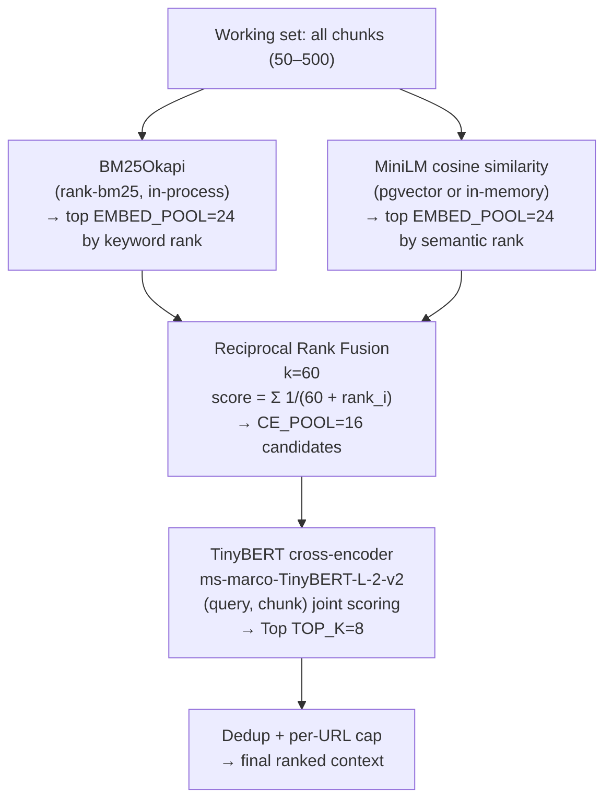
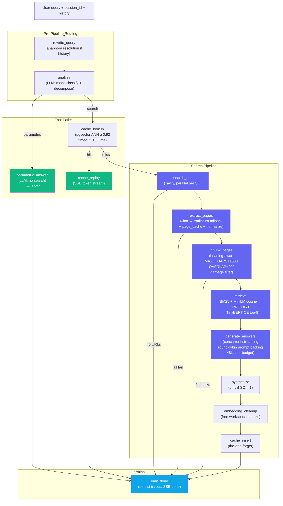

# RAG Pipeline — WebLens

> Current as of v9 (2026-05-11). This document is a deep-dive into the retrieval and generation lifecycle. For the system architecture and LangGraph orchestration see [ARCHITECTURE.md](./ARCHITECTURE.md). For evaluation results see [evaluation-results-summary.md](./evaluation-results-summary.md).

---

## Pipeline Overview

WebLens runs a multi-stage pipeline for every search query. In v7+, this pipeline is driven by a **LangGraph `StateGraph`** with 13 nodes and 3 conditional routing decisions that happen before the linear retrieval stages:

```
User Query
    │
    ▼
[rewrite_query] ─── resolve anaphora from prior turns
    │
    ▼
[analyze] ─── LLM classifies + decomposes
    │
    ├─[parametric]──────────────────────────────────────────────┐
    │   ↓                                                        │
    │  [parametric_answer]                                       │
    │   → LLM answers directly (no search)                      │
    │                                                            │
    └─[search]                                                   │
          │                                                      │
          ▼                                                      │
       [cache_lookup] (pgvector ANN ≥ 0.92)                     │
          ├─[hit]── [cache_replay] → SSE token replay            │
          │                                                      │
          └─[miss]                                               │
                │                                               │
                ▼                                               │
         [search_urls] → Tavily (parallel per sub-query)        │
                │                                               │
                ▼                                               │
         [extract_pages] → Jina + trafilatura + page_cache      │
                │                                               │
                ▼                                               │
         [chunk_pages] → heading-aware + garbage filter         │
                │                                               │
                ▼                                               │
         [retrieve] → BM25 + dense + RRF + TinyBERT             │
                │                                               │
                ▼                                               │
         [generate_answers] → concurrent streaming per SQ       │
                │                                               │
                ▼                                               │
         [embedding_cleanup]                                    │
                │                                               │
                ▼                                               │
         [cache_insert] (fire-and-forget)                       │
                │                                               │
                ▼                                               │
            [emit_done] ◄──────────────────────────────────────┘
                │
                ▼
          Final answer + citations → SSE done event
```

---

## Stage-by-Stage Breakdown

### Stage 0A — Query Rewrite (`pipeline/analyze.py`: `rewrite_query`)

**What it does:** If prior conversation turns exist, the rewriter resolves anaphoric references and topic continuations before the pipeline sees the query. Examples of what it handles:
- "What about their margins?" → "What are [Company]'s operating margins?"
- "How does that compare to last year?" → "How does [X] compare year-over-year?"

**What it does NOT do:** It does not modify standalone messages or attempt cross-topic contamination. Negative few-shot examples defend against rewriting "Change topic: what is Python?" into a finance question.

**Why it matters:** Without rewriting, the decompose step sees a fragment; the semantic cache sees an unreliable key; retrieved chunks are irrelevant. The rewriter is gated on history existence — it is not a default pass-through LLM call.

**Failure mode prevented:** Embedding a bare pronoun or fragment into the query cache would cause incorrect cache hits on unrelated queries from other sessions.

---

### Stage 0B — Analyze (Route + Decompose) (`pipeline/analyze.py`: `analyze_query`)

**What it does:** A single LLM call returns `{mode: parametric|search, sub_queries: [...], rationale}`.

**Routing logic:**

| Route | Definition | Typical latency saving |
|---|---|---|
| `parametric` | Textbook-stable: arithmetic, basic geography, classic literature, fundamental CS | ~20–50s vs full search |
| `search` | Anything that drifts over time, requires source grounding, or is recent | — |

The prompt is biased aggressively toward `search` — the parametric few-shots are limited to: arithmetic operations, capitals/countries (stable), classic novel authorship, foundational CS definitions (Big-O notation, what a hash table is). "What is the current population of Brazil?" routes `search` despite being nominally factual, because population figures change.

**Decomposition:** for `search` queries, the LLM generates the minimum set of sub-queries that together cover the original question. The prompt's **Temporal Reasoning** section anchors all date inferences to `{today}` (injected at runtime) rather than training-data defaults.

**Decomposition quality is the primary driver of multi-hop answer quality.** The key failure mode is `under_decomposition` — treating "Compare Real Madrid and Manchester City CL performance over 3 seasons" as a single query instead of decomposing by club and season. The v9 13-node split and `rewrite_query` improvements are specifically aimed at this.

---

### Stage 1 — URL Discovery (`pipeline/search.py`)

**What it does:** Tavily Search API called once per sub-query, in parallel via `asyncio.gather`. Default `max_results=6` per sub-query. Results are deduplicated globally by URL.

**Key data structure:** `url_to_subqueries: Dict[str, List[int]]` — maps each URL to the list of sub-query indices that surfaced it. A URL surfaced by sub-queries 0 and 2 gets the mapping `{url: [0, 2]}`. This enables honest per-sub-query stats downstream without re-running extraction.

**Why Tavily over alternatives:** Tavily returns structured results (title, snippet, URL) with a simple API. The snippet is used for early filtering; the full page is extracted in Stage 2. Alternatives (Bing, Google CSE, SerpAPI) require more setup or have less permissive free tiers.

**Failure mode:** If Tavily returns no URLs for any sub-query, the pipeline short-circuits at this stage with `error: no_urls`. This is preferable to extracting 0 pages and generating a hallucinated answer.

---

### Stage 2 — Page Extraction (`pipeline/extract.py`)

**What it does:** Runs **once globally** on the deduplicated URL list — not once per sub-query. This is the single most important efficiency decision in the pipeline.

```
URL list (deduplicated)
    │
    ├─ page_cache hit?  → return cached markdown (~50ms)
    │
    └─ page_cache miss
          ├─ Jina Reader (r.jina.ai/{url}) → clean markdown
          └─ trafilatura fallback (4xx, timeout, >2s)
                │
                ▼
          _normalize_unicode() [NFKC + zero-width removal]
          _strip_boilerplate() [nav, subscribe, promo patterns]
                │
                ▼
          page_cache.upsert(url, markdown, expires_at=now+2h)
```

**Why full-page extraction over snippets:** Tavily's snippets are 100–200 chars. A 1500-char chunk containing the actual answer passage cannot be recovered from a snippet. Full-page extraction trades extraction latency (~800ms cold, ~50ms cached) for significantly higher recall and faithfulness.

**Jina Reader** returns markdown with heading structure preserved, which is critical for the heading-aware chunker in Stage 3. For sites behind paywalls or CDN-rate-limited for Jina's IP range, trafilatura provides a local Python fallback using HTML parsing.

**Unicode normalization (v9):** `NFKC` normalization resolves ligatures, width variants, and compatibility characters that corrupt chunk text. Zero-width characters (zero-width joiner, non-breaking space, soft hyphen) are stripped. This is applied before the page is stored in `page_cache` — cached pages are clean.

**Boilerplate stripping (v9):** Navigation fragments, subscribe prompts, read-more patterns, and short ALL_CAPS promo lines are stripped before chunking. This directly improves context precision by reducing the fraction of garbage chunks that pass Stage 6's garbage filter.

---

### Stage 3 — Chunking (`pipeline/chunk.py`)

**Strategy: heading-aware markdown chunker**

```
Input: markdown with heading hierarchy (#, ##, ###)

Step 1: segment by heading boundaries
Step 2: enforce max 1500 chars per chunk (split at sentence boundary)
Step 3: 200-char overlap between adjacent chunks (preserves context continuity)
Step 4: filter: min body 150 chars, min words 8

Garbage filter (additional):
  - link density > 40% AND ≥ 3 links   → nav-link list, drop
  - > 50% lines match nav keywords       → nav fragment, drop
  - word count < 8                       → too short, drop

Output: (chunks[], global_stats, per_url_stats)
  per_url_stats enables honest per-sub-query stat partitioning downstream
```

**Why heading-aware over fixed-size:** A fixed-size window that crosses a `## Revenue` to `## Expenses` heading boundary mixes topics. The retriever then gets a chunk with partial relevance to both headings — degrading both precision and faithfulness. Heading boundaries are semantic boundaries; they are the natural split point for documents with structured sections.

**Overlap:** 200-char overlap ensures that a key sentence near a chunk boundary is covered by both adjacent chunks. Without overlap, a sentence at position 1490 in a 1500-char chunk is only retrievable if the retriever selects that specific chunk.

**Drop categories tracked:** `garbage_dropped`, `min_body_dropped`, `dedup_dropped`. These stats surface in the eval trace panel under "chunk_done".

---

### Stage 4 — Embedding (`pipeline/embed.py`)

**Model:** `all-MiniLM-L6-v2` (sentence-transformers), 384 dimensions, L2-normalized.

**Execution:** `sentence_transformer.encode(texts, batch_size=32)` runs in `loop.run_in_executor(None, ...)` — the sync model inference runs in a thread pool so the asyncio event loop stays unblocked.

**Device:** auto-detected. CUDA if available (GPU inference ~10× faster); CPU otherwise. On Railway (no GPU), CPU batch encoding at 384-dim is sufficient for typical working sets of 50–300 chunks.

**Embedding reuse:** embeddings are upserted to `web_chunks` with the URL as a key. A URL that appears in multiple sessions (e.g., a popular documentation page) is never re-embedded — the existing embedding is reused from the DB.

**Latency profile:** 300–500ms for a typical 100-chunk batch on CPU. This is the longest synchronous operation in the pipeline; moving it to a GPU instance would cut this to ~30–50ms.

---

### Stages 5–6 — Hybrid Retrieval and Reranking (`pipeline/retrieve.py`)

This is the highest-leverage stage in the pipeline. Retrieval quality directly bounds faithfulness — a relevant passage that is not retrieved cannot be cited.



**BM25 — why it's needed despite dense retrieval:**
- Captures exact entity name matches (ticker symbols, product names, person names)
- Handles technical terminology with low semantic variation
- Fast to compute in-process (no vector DB round-trip for the BM25 stage)
- Dense-only RAG systems consistently underperform on entity-dense queries

**Dense retrieval — why BM25 isn't enough:**
- Captures semantic equivalence: "earnings" ↔ "revenue", "showed" ↔ "demonstrated"
- Handles paraphrased questions where none of the query tokens appear in the passage
- Dense retrieval requires embedding both query and chunks at the same dimensionality

**RRF (k=60) — why not score fusion:**
- BM25 scores and cosine similarity scores are on different scales and distributions
- Score normalization requires calibration that doesn't generalize across query types
- RRF only uses rank positions — robust to score distribution differences
- k=60 is a well-established constant; the formula `1/(60 + rank)` down-weights later ranks smoothly

**Cross-encoder reranking — the precision layer:**
- A bi-encoder (MiniLM) encodes query and chunk independently; similarity is approximate
- A cross-encoder attends to token interactions between query and chunk — it can identify that "the company reported $6.1B in revenue" is the answer to "what was the operating revenue?" even if neither "operating" nor "revenue" appears in the chunk text
- Operating over only 16 candidates (CE_POOL) makes cross-encoder inference tractable: TinyBERT forward pass is fast, and 16 candidates is well within CPU batch limits
- Scoring runs in `run_in_executor` to avoid blocking the event loop

**Per-URL cap:** no single source dominates the final context. This prevents a single verbose page from crowding out other URLs and improves citation diversity.

**v9 LangSmith visibility:** four `@traceable` inner wrappers expose individual retrieval stages as named spans: `_traced_bm25`, `_traced_dense_embed_and_score`, `_traced_rrf`, `_traced_rerank`. Each appears as a `retriever` or `chain` span in LangSmith.

---

### Stage 7 — Generation (`pipeline/generate.py`)

**What it does:** One streaming LLM call per sub-query, all concurrent.

```python
# Concurrent streaming (simplified)
tasks = [generate_stream(sq, chunks, citations, history, queue) for sq in sub_queries]
await asyncio.gather(*tasks)
```

All sub-query coroutines stream their tokens concurrently into a single `asyncio.Queue`, which is drained by the SSE response. The user sees tokens from all sub-queries interleaved — not one sub-query at a time.

**Prompt construction (`_build_prompt`):**

```
System: answer the question using ONLY provided sources; cite as [N]
        Recent conversation context block (if history): [do NOT cite — only sources]

Sources (round-robin packing, 48k char budget):
  [1] Title: {title} | URL: {url} | Heading: {heading}
  {chunk_text}
  [2] ...

Question: {sub_query}
```

**Round-robin source packing:** distributes the 48,000-char budget proportionally across all URLs. The previous per-URL 6,000-char hard cap silently dropped chunks when any single URL was verbose. Round-robin ensures no source is disproportionately truncated while staying within the LLM's context window.

**History injection:** prior turns (last 4, capped at 2000 chars) are injected as a bracketed block explicitly labelled "do NOT cite". This allows the generation LLM to resolve mid-answer references (e.g., "the model discussed above") that the rewriter couldn't fully resolve into sub-query text.

**Citation alignment:** every `[N]` in the generated text references a specific source block injected into the prompt. The post-processing step validates citation indices and builds the `citations` list from referenced source metadata.

---

### Stage 8 — Synthesis (`pipeline/generate.py`: `synthesize_stream`)

**Only runs when `len(sub_queries) > 1`.**

Synthesis takes all per-sub-query answers and merges them into a single coherent markdown answer. The global citation map ensures `[N]` numbers from sub-answers survive the synthesis rewrite — the synthesis LLM sees the same `[N]` source blocks.

**Why synthesis is needed:** without synthesis, a multi-hop answer would be a concatenation of independent sub-answers with duplicated context and inconsistent prose. Synthesis produces a unified response that reads as a single answer while preserving all source attributions.

**Hallucination risk:** synthesis introduces a second LLM call over already-synthesized text. The prompt instructs the synthesis LLM to not add information beyond what sub-answers contain and to maintain all `[N]` citations. This is enforced via prompt instruction, not post-hoc validation.

---

## Full Pipeline Mermaid Diagram



---

## Model Choices and Justification

| Stage | Model / Technology | Why chosen | Alternative considered | Tradeoff |
|---|---|---|---|---|
| Route + Decompose | DeepSeek V3 (LLM) | Instruction-following quality; low cost; fast streaming | GPT-4o | DeepSeek ~10× cheaper per token; equivalent decomposition quality in testing |
| URL Discovery | Tavily Search API | Structured results; clean API; good recall on recent web content | Bing API, Google CSE | Tavily free tier is generous; less complex auth; smaller ecosystem |
| Page Extraction (primary) | Jina Reader | Returns clean markdown preserving heading structure | Playwright headless | No browser dependency; ~800ms cold vs ~3s headless |
| Page Extraction (fallback) | trafilatura | Pure Python; no external API dependency; handles most HTML layouts | BeautifulSoup | trafilatura is purpose-built for content extraction with boilerplate removal |
| Embedding | all-MiniLM-L6-v2 (384-dim) | Fast encoding; good semantic quality; small memory footprint | all-mpnet-base-v2 (768-dim), OpenAI ada-002 | MiniLM is ~2× faster than MPNet with ~5% quality gap; avoids per-embedding API cost |
| Sparse retrieval | BM25Okapi (rank-bm25) | In-process, no external service; robust on entity names and technical terms | Elasticsearch, Typesense | rank-bm25 is sufficient for in-memory working sets; no ops overhead |
| Fusion | RRF (k=60) | No score calibration required; robust across score distribution differences | Score normalization, CombSUM | RRF is statistically dominant in TREC benchmarks; dead simple to implement |
| Reranker | ms-marco-TinyBERT-L-2-v2 | Fast cross-encoder inference on CPU; strong precision improvement over bi-encoders | MonoT5, BGE reranker | TinyBERT is ~4× faster than full BERT CE with ~2% quality gap; no GPU required |
| Generation | DeepSeek V3 (primary) / OpenAI (fallback) | Streaming support; reliable availability; cost-effective | Anthropic Claude, Cohere | DeepSeek significantly cheaper for synthesis-quality tasks |
| Vector DB | pgvector (PostgreSQL) | Co-located with session and cache data; IVFFlat sufficient at this scale | Pinecone, Qdrant, Weaviate | No additional service to operate; native Postgres ops (backup, connection pooling) apply |
| Orchestration | LangGraph | LangSmith observability included; conditional routing as first-class graph edges | Custom coroutine, Celery | LangGraph is async-native; adds ~50ms overhead vs raw coroutine; observability justifies it |

---

## Design Principles

**1. Source grounding over LLM knowledge.** Every non-parametric answer must reference retrieved chunks. The generation prompt explicitly instructs the model to cite all claims and to refuse rather than speculate when no relevant chunk exists. The faithfulness metric directly measures compliance.

**2. Global extraction, not per-sub-query.** Extraction runs once on the deduplicated URL union. Per-sub-query stats are computed post-hoc. This eliminates redundant Jina/trafilatura calls and ensures citation number consistency across sub-answers and synthesis.

**3. Three retrieval signals.** BM25 alone fails on paraphrased queries. Dense alone fails on entity names and technical terms. The cross-encoder adds a final precision pass that both bi-encoder types miss. The combination is not architectural elegance — it is empirically superior recall and precision.

**4. Streaming first.** The user receives `decompose_done` within ~500ms and first tokens within ~3s, regardless of how long the full pipeline takes. Streaming is not a UI nicety — it is a latency contract. Every blocking operation runs in `run_in_executor` to honor it.

**5. Failure is surfaced, not hidden.** Every stage failure emits a typed SSE error event with a machine-readable `reason`. The UI renders per-URL extraction failures as chips. The eval harness's `failures.md` auto-classifies probable cause for the worst-N questions per run. Observability is built in, not bolted on.

---

## Latency Breakdown

| Stage | Warm (cache hit) | Cold (full path) | Notes |
|---|---|---|---|
| Rewrite + Analyze | 300–600ms | 400–900ms | 1–2 LLM calls |
| Cache lookup | 50–200ms | 50–200ms | 1500ms hard timeout; treated as miss on timeout |
| Tavily search | — | 400–1200ms | Parallel per SQ |
| Page extraction | ~50ms | 500–2500ms | Cache hit vs Jina cold fetch |
| Chunk + Embed | 200–400ms | 200–500ms | MiniLM batch; executor-backed |
| BM25 + RRF + Rerank | 100–200ms | 100–300ms | In-process; TinyBERT over 16 candidates |
| Generate (streaming) | 1500–3500ms | 1500–4000ms | Perceived latency hidden by SSE |
| Synthesize | — | 1000–3000ms | Multi-SQ only |
| **End-to-end** | **3–5s** | **5–60s** | Single SQ warm vs multi-hop cold |

Parametric path: 2–5s total (analyze + LLM answer, no search stages).  
Cache hit path: 1–3s total (analyze + cache lookup + token replay).

---

## Evaluation Hooks

The pipeline emits structured data at every stage that feeds the evaluation harness:

| Stage | What's captured | Eval use |
|---|---|---|
| `analyze` | `mode`, `sub_queries`, `rationale` | `routing_decomposition` metric |
| `retrieve` | Top-K chunks with scores, `explain` field | Context recall and precision |
| `generate` | Answer text, citation indices used | Faithfulness, answer correctness |
| `emit_done` | Full JSONB traces per sub-query | `rehydrateSteps` for trace replay |
| LangSmith | Per-node typed spans with input/output | Debugging failed retrievals |

`failures.md` auto-classifies probable cause per failed question:

| Cause | Signal |
|---|---|
| `retrieval_miss` | Context recall < 0.3 AND faithfulness > 0.5 |
| `hallucination` | Faithfulness < 0.3 AND answer correctness < 0.5 |
| `wrong_route` | Routing score < 0.5 AND answer correctness > 0.8 |
| `under_decomposition` | Routing score < 0.5 (actual count < expected count) |
| `citation_theater` | Faithfulness low despite good context recall |
| `refusal_failure` | Expected refusal not present |

---

## Future Improvements

| Area | Improvement | Expected impact |
|---|---|---|
| Context precision | Tune cross-encoder threshold; add diversity-based filtering | Reduce noise in CE_POOL; improve faithfulness |
| Multi-hop decomposition | Add reflection node: after retrieve, check coverage; decompose again if gaps found | Address `under_decomposition` failure mode |
| Reranker upgrade | BGE-reranker-v2-m3 or full BERT cross-encoder on GPU | ~5–8% precision improvement |
| Hallucination reduction | Post-hoc claim verification pass: detect LLM-added uncited claims | Faithfulness score target: 0.80+ |
| Embedding model | all-mpnet-base-v2 (768-dim) on GPU | Improved semantic recall for dense retrieval |
| LLM cost tracking | Wire `TokenTracker.record()` from LLM client `usage` blocks | Enables per-query cost attribution |
| Query expansion | Before BM25, expand query with synonyms or LLM-generated variants | Improve sparse retrieval recall on paraphrased queries |
| Streaming synthesis | Stream synthesis tokens while sub-answers are still generating | Reduce perceived latency for multi-SQ queries |
